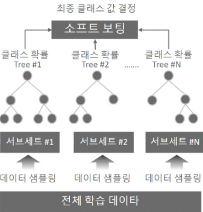
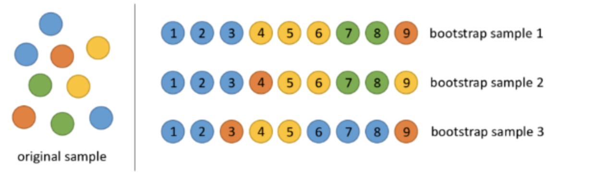

# 랜덤포레스트 
- 같은 알고리즘으로 여러 분류기를 만들어 보팅으로 최종 결정하는 배깅의 대표 알고리즘
- 빠른 수행 속도, 높은 예측 성능 
- 결정 트리 기반 알고리즘으로 쉽고 직관적으로 모델 해석 가능 
- 무작위성을 도입하여 안정적인 예측이 가능하도록 하여 일반화에 용이 
    - 단일 결정 트리는 훈련 데이터의 특수성에 영향을 많이 받지만 랜덤포레스트는 부트스트랩 샘플링으로 무작위로 훈련데이터를 샘플링하기 때문에 데이터의 가변성을 주어 과적합 가능성을 줄이고 모델을 견고하게 만듦
    - 트리의 노드를 분할할 때, 전체 특성 중에서 최적의 특성을 찾는 대신,무작위로 선택한 특성 후보 중에서 최적의 특성을 찾는 방식 적용하여 무작위성을 줌.
- 여러 개의 결정 트리 분류기가 전체 데이터에서 샘플링된 데이터(중복 허용)로 개별적으로 학습 수행 후 최종적으로 모든 분류기가 보팅을 통해 예측 결정 

### 부트스트래핑 방식의 데이터 샘플링 
- 개별 트리가 학습하는 데이터는 전체 데이터에서 중복을 허용하여 샘플링된 데이터로, 중복 허용해서 샘플링하는 걸 통계학에서는 부트스트래핑(bootstrapping)이라고 하기 때문에 bootstrap aggregating의 줄임말로 bagging이라고 이름이 붙여짐 
- 서브세트의 데이터 건수는 전체 데이터 건수와 동일하고 개별 데이터가 중첩됨
- 예시) 데이터 건수=9, n_estimators=3 

### 예제 코드 
- 사이킷런의 RandomForestClassifier 클래스 이용 
- 사용자 행동 인식 데이터 세트 활용(스마트폰 센서로 사람 행동 예측)
```python
from sklearn.ensemble import RandomForestClassifier
from sklearn.metrics import accuracy_score
import pandas as pd
import warnings
warnings.filterwarnings('ignore')

# 결정 트리에서 사용한 get_human_dataset( )을 이용해 학습/테스트용 DataFrame 반환
X_train, X_test, y_train, y_test = get_human_dataset()

# 랜덤 포레스트 학습 및 별도의 테스트 셋으로 예측 성능 평가
rf_clf = RandomForestClassifier(random_state=0)
rf_clf.fit(X_train , y_train)
pred = rf_clf.predict(X_test)
accuracy = accuracy_score(y_test , pred)
print('랜덤 포레스트 정확도: {0:.4f}'.format(accuracy))
```
### 랜덤포레스트 하이퍼파라미터 및 튜닝
- 하이퍼파라미터 참고 : https://scikit-learn.org/stable/modules/generated/sklearn.ensemble.RandomForestClassifier.html

|하이퍼파라미터|설명|default|
|------|---|---|
|n_estimators|결정 트리 개수. 늘릴 수록 좋은 성능을 기대하지만 수행 시간이 오래 걸리고 무조건 클수록 좋은 건 아님|10|
|max_features|분할 시 고려하는 피처 수|'auto'(='sqrt')|
|max_depth|트리의 깊이|None|
|min_samples_leaf|각 잎(leaf) 노드에 필요한 최소 샘플 수|1|

- GridSearchCV 를 이용해 튜닝 
```python
from sklearn.model_selection import GridSearchCV

params = {
    'n_estimators':[100],
    'max_depth' : [6, 8, 10, 12], 
    'min_samples_leaf' : [8, 12, 18 ],
    'min_samples_split' : [8, 16, 20]
}
# RandomForestClassifier 객체 생성 후 GridSearchCV 수행
rf_clf = RandomForestClassifier(random_state=0, n_jobs=-1)
grid_cv = GridSearchCV(rf_clf , param_grid=params , cv=2, n_jobs=-1 )
grid_cv.fit(X_train , y_train)

print('최적 하이퍼 파라미터:\n', grid_cv.best_params_)
print('최고 예측 정확도: {0:.4f}'.format(grid_cv.best_score_))
```
### 피처 중요도 시각화 
- 랜덤 포레스트는 변수의 상대적 중요도를 측정하기 쉬움
- 사이킷런은 랜덤 포레스트 모형이 가진 모든 트리에 걸쳐서, 평균적으로 불순도를 얼마나 감소시키는지를 확인하여 변수의 상대적 중요도를 측정
- 이후, 변수별 중요도의 전체합이 1이 되도록 정규화를 진행
- 변수 중요도는 feature_importances_에 저장 됨

```python
import matplotlib.pyplot as plt
import seaborn as sns
%matplotlib inline

ftr_importances_values = rf_clf1.feature_importances_
ftr_importances = pd.Series(ftr_importances_values,index=X_train.columns  )
ftr_top20 = ftr_importances.sort_values(ascending=False)[:20]

plt.figure(figsize=(8,6))
plt.title('Feature importances Top 20')
sns.barplot(x=ftr_top20 , y = ftr_top20.index)
fig1 = plt.gcf()
plt.show()
plt.draw()
fig1.savefig('rf_feature_importances_top20.tif', format='tif', dpi=300, bbox_inches='tight')
```