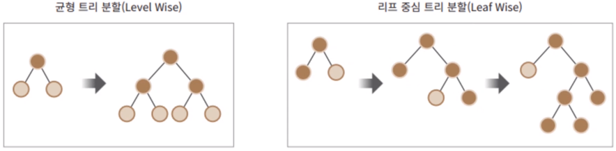

# LightGBM
### 특징
- XGBoost보다 빠른 학습시간과 예측 수행 시간.
- 더 적은 메모리 사용량.
- 카테고리형 피처의 자동 변화과 최적 분할 
- GPU 지원도 가능 
- lightgbm 패키지에 파이썬 래퍼용 LightGBM에 사이킷런 래퍼 LightGBM 클래스인 LGBMClassifier, LGBMRegressor 클래스 지원 
- 적은 데이터세트(약 만 건 이하)에서는 과적합 가능성 큼
- 트리의 깊이를 효과적으로 줄이기 위한 균형 트리 분할(Level wise) 방식 대신, 리프 중심 트리 분할 방식(Leaf Wise) 사용
- 균형 잡힌 트리가 과적합에 강한 구조지만 균형을 맞추는 시간이 필요
- 리프 중심 트리 분할 방식은 트리의 균형을 맞추지 않고 최대 손실 값(max delta loss)을 가지는 리프 노드를 지속적으로 분할 
- 트리의 깊이가 깊어지고 비대칭적 규칙 트리가 생성되지만, 균형 트리 분할 방식보다 예측 오류 손실을 최소화 
 

### 설치 
```
conda install -c conda-forge lightgbm
```
## LightGBM 하이퍼 파라미터 
#### 주요 파라미터
- num_iterations[default=100]: 반복 수행하려는 트리의 개수 지정. 크게 지정할수록 예측 성능이 높아지지만 과적합 가능성 있음. 
- learning_rate[default=0.1]: 0에서 1 사이. 부스팅 스텝을 반복적으로 수행할 때 업데이트되는 학습률. 일반적으로 n_estimators를 크게 하고, learning_rate를 작게 해서 성능을 높이나 과적합 주의 필요.
- max_depth[default=-1]: 0 보다 작은 값 지정 시 깊이 제한 없음. LightGBM은 leaf wise 방식으로 깊이가 상대적으로 더 깊음. 
- min_data_in_leaf[default=20, min_child_samples]: min_samples_leaf와 같은 파라미터. 최종 결정 클래스인 리프 노드가 되기 위해 최소한으로 필요한 레코드 수, 과적합 제어에 사용 
- num_leaves[default=31]:하나의 트리가 가질 수 있는 최대 리프 개수 
- boosting[default=gbdt]: 부스팅의 트리 생성 알고리즘 
    - gbdt: 그래디언트 부스팅 결정 트리 
    - rf : 랜덤 포레스트 
- bagging_fraction[default=1.0, subsample]: 과적합 제어를 위해 데이터 샘플링하는 비율 지정. 
- feature_fraction[default=1.0, max_features, colsample_bytree]: 개별 트리 학습 시 무작위로 선택하는 피처의 비율. 과적합 제어 파라미터. 
- lambda_l2: L2 regularization 제어를 위한 값 
- lambda_l1: L1 regularization 제어를 위한 값 
#### Learning Task 파라미터 
- objective : 최솟값을 가져야 할 손실함수
### 하이퍼 파라미터 튜닝 방안
- num_leaves, min_child_samples, max_depth를 함께 조정하며 모델의 복잡도를 줄임
- learning_rate를 작게 하며 n_estimators를 크게 함
- 과적합 방지를 위해 reg_lambda, reg_alpha와 같은 regularization 적용하거나 colsample_bytree, subsample 파라미터를 적용해 학습 데이터에 사용할 피처 개수나 데이터 샘플링 레코드 수를 줄임. 
