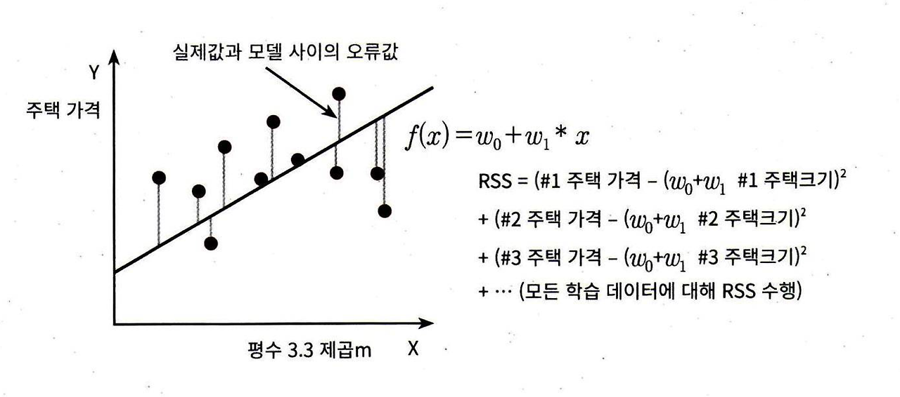
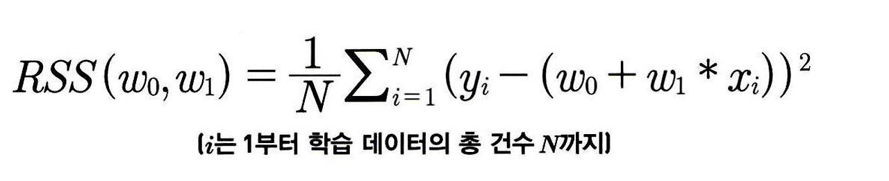
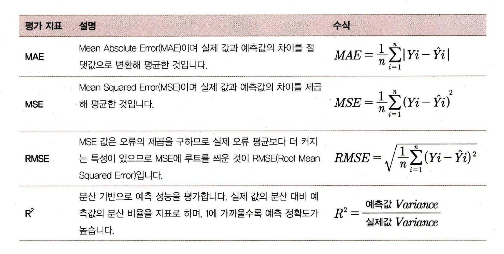

## 5.1 회귀소개
- 회귀 : 여러 개의 독립변수와 한 개의 종속변수(설명변수) 간의 상관관계를 모델링하는 기법 
- 예) 아파트 가격 = W1X아파트 방 개수 + W2X방 크기+ W3X주변 학군+ ・・・
- 각 독립변수가 종속 변수에 얼마나 영향을 미치는지 정도(W)를 나타내는 최적의 회귀 계수(Regression coefficients)를 찾아내는 것 
- 회귀 계수의 선형성에 따라 선형 회귀/비선형 회귀로 나뉨 
- 독립 변수의 개수의 따라 단일 회귀/다중 회귀로 나뉨
- 선형 회귀 : 실제 값과 예측값의 차이(오류의 제곱 값)를 최소화하는 직선형 회귀선을 최적화
- 규제(Regularization) :  과적합 문제 해결을 위해 회귀 계수에 패널티 값 적용하는 것 
### 선형 회귀 모델
|선형 회귀 모델|설명|
|--|--|
|일반 선형 회귀|예측값과 실제 값의 RSS(Residual Sum of Squares)최소화할 수 있도록 회귀 계수 최적화, 규제 x|
|릿지(Ridge)|선형 회귀에 L2(상대적으로 큰 회귀 계수 값의 예측 영향도를 감소시키기 위해 회귀 계수값을 작게 만드는 규제)규제 추가. |
|라쏘(Lasso)|선형 회귀에 L1 규제(예측 영향력이 작은 피처의 회귀 계수를 0으로 만들어 회귀 예측 시 피처가 선택되지 않도록 함) 적용. |
|엘라스틱넷(ElasticNet)|L2, L1 규제 결합한 모델. 피처가 많은 데이터 세트에 적용. L1 규제로 피처의 개수를 줄이고, L2 규제로 계수 값의 크기 조정|
|로지스틱 회귀(Logistic Regression)|분류에 사용되는 선형 모델. 이진 분류 뿐 아니라 텍스트 분류와 같은 영역에서 뛰어난 예측 성능을 보임|

## 5.2 단순 선형 회귀를 통한 회귀 이해 
- 단순 선형 회귀 : 독립 변수도 하나, 종속 변수도 하나인 선형 회귀 
- 예) 주택 크기의 따라 주택 가격이 결정
    - 주택 가격 = W0 + W1 * 주택 가격 
    
- 잔차 : 실제 값과 회귀 모델의 예측값 차이에 따른 오류 값 
- 전체 데이터의 잔차(오류 값)의 합이 최소가 되는 회귀 계수를 학습을 통해 찾음. 
- 오류 합을 계산 할 때 오류가 +/-가 섞여 나오므로 절대값(MAE, Mean Absolute Error) 혹은 제곱합(RSS, Residual Sum of Square)을 이용하여 계산 
- 일반적으로 미분 등의 계산을 편리하게 하기 위해 RSS 사용 
    
- RSS 식을 비용 함수(손실 함수)라고 하며, 회귀 알고리즘은 데이터를 학습하면서 비용 함수가 반환하는 오류 값을 감소하여 가장 작은 오류 값을 구함.

### 회귀 평가 지표 
- 실제 값과 예측값의 차이를 그냥 더하면 +, - 값이 섞이면서 오류가 상쇄되기 때문에 오류의 절대값 평균, 제곱을 이용하거나 제곱한 뒤 다시 루트를 씌운 평균값으로 성능을 평가함.
- 해당 지표 외 MSE, RMSE에 로그를 적용한 MSLE(Mean Squared Log Error), RMSLE(Root Mean Squared Log Error)도 사용

- 사이킷런에서는 RMSE를 지원하지 않음.
- 사이킷런에서 cross_val_score, GridSearchCV 에서 평가 시 사용하는 파라미터 적용 값 

- 사이킷런의 Scoring 함수는 큰 값일수록 좋은 결과로 평가하기 때문에 오류가 적게 나타났을 때 더 좋은 평가를 주기 위해 -1 값을 곱해 음수로 변환 