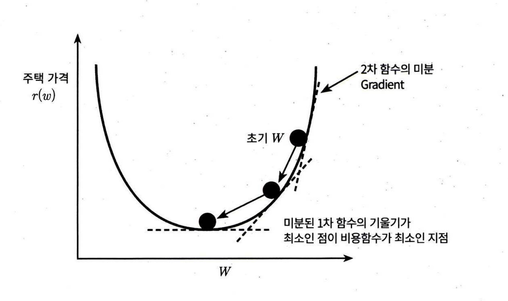
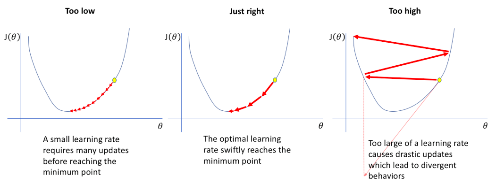
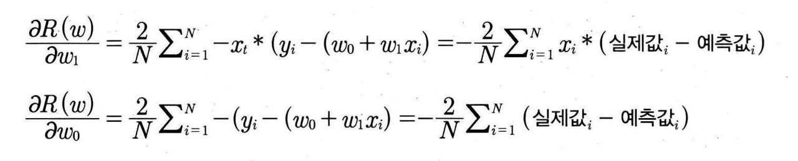
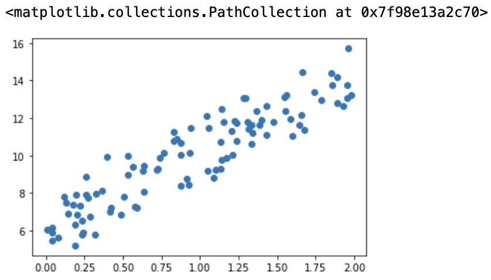

## 5.3 경사하강법
- 피처 수가 많아지면 구해야 하는 W 파라미터의 개수가 많아지므로 복잡성이 증가
- 경사하강법 : 𝜃를 임의의 값으로 시작해서 점차 비용함수(Cost)가 낮아지는 방향으로 파라미터를 조정하며 비용 함수가 최소가 되는 회귀계수를 구하는 방법
- 2차 함수인 비용 함수의 미분 값인 1차 함수 기울기가 최소(미분 값(기울기)이 계속 감소하다가 더 이상 기울기가 감소하지 않는 지점)일 때가 비용 함수가 최소가 되는 지점 

- 학습률(Learning Rate) 기반, 학습 스텝 크기를 정하여 훈련 속도 및 최적화 능력을 제어
    - 학습률이 낮으면 변화폭을 낮게 조정하여 느리게 학습 진행.지역 최소값을 찾게 될 우려 존재
    - 학습률이 높으면 변화폭을 크게 조정하여 빠르게 학습을 진행되지만, 비용함수 최소화의 어려움 존재


### 경사하강법 수식
- 비용함수를 최소화하는 W0, W1 값은 RSS(W0,W1)를 편미분한 값

- 경사하강법의 프로세스 : W0, W1에 대한 편미분 값을 통해 계속해서 W0, W1을 업데이트해가면서 비용 함수의 최솟값을 구함
    1. W0, W1 임의의 값으로 설정하고 첫 비용 함수의 값을 계산합니다.
    2. W0, W1을 학습률에 편미분 값을 곱한 값을 반영하여 업데이트 한 뒤 비용 함숫값을 계산합니다.
    3. 비용 함수가 감소하지 않을 때까지 2번을 계속 반복합니다.

### 예제
- y=4X+6을 근사하기 위해 100개의 데이터세트를 만들고 회귀 계수 W0,W1를 도출하는 예제
```python
import numpy as np
import matplotlib.pyplot as plt
%matplotlib inline

np.random.seed(0)
# y = 4X + 6 식을 근사(w1=4, w0=6). random 값은 Noise를 위해 만듬
X = 2 * np.random.rand(100,1)
y = 6 +4 * X+ np.random.randn(100,1)

# X, y 데이터 셋 scatter plot으로 시각화
plt.scatter(X, y)
```

