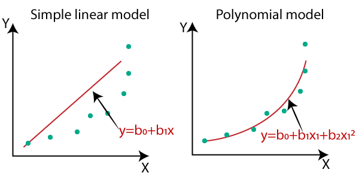
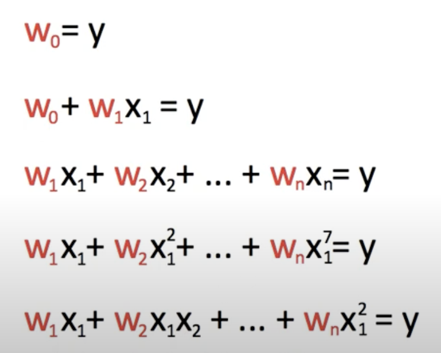
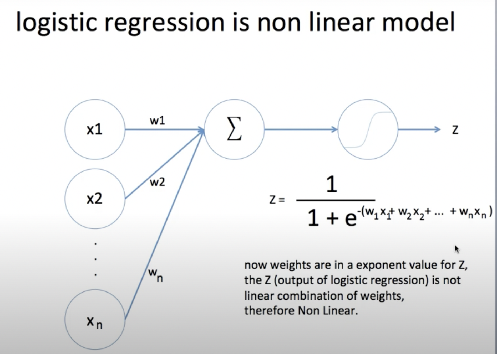
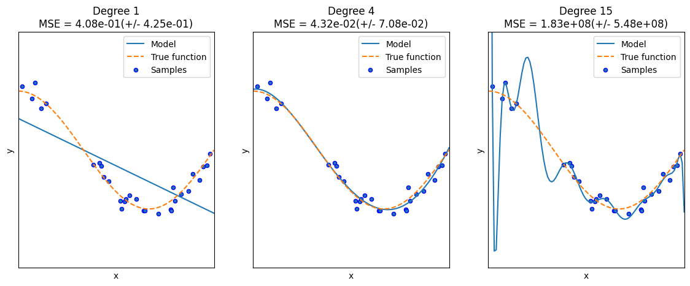
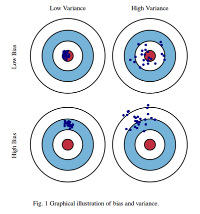
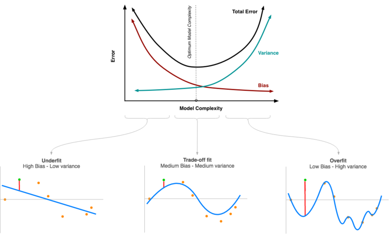

# 다항회귀와 과적합/과소적합 이해
## 다항 회귀 이해 
- 다항 회귀 : 독립변수가 다항식으로 표현되는 회귀식
- 예) $y = w_{0} + w_{1}*x_{1}+w_{2}*x^2$
- 다항회귀(Polynomial)는 2차, 3차 방정식처럼 차수가 높은 다항식으로 표현되는 회귀모델을 말하고, 특징이 여러 개인 모델은 다중선형회귀모델(Multiple linear model)이라 함
- 단일 선형 회귀보다 다항 회귀가 더 복잡한 표현도 가능하기 때문에 오차가 적어 예측 성능이 좋음
 
- 다항 회귀의 회귀 계수가 선형이기 때문에 다항 회귀도 선형 회귀
    - 계수(w)들이 선형 결합 관계에 있을 때 선형회귀 모델
    - 특징(독립변수)을 복잡하게 표현하거나 여러 특징을 사용하여 y를 표현해도 계수는 여전히 선형 결합 관계에 있기 때문에 다항회귀, 다중회귀 모두 선형 모델임 
    - 
    - 반면, 로지스틱 회귀의 경우 시그모이드 함수를 거쳐 결과가 나오고, 회귀계수가 선형결합이 아니기 떄문에 비선형모델임
    

- 사이킷런은 다항 회귀 클래스를 제공하지 않으나 비선형 함수를 선형 모델에 적용하여 구현 
    - PolynomialFeatures 클래스를 통해 피처를 다항식 피처로 변환 
    - degree 파라미터를 이용해 단항식 피처를 입력받은 degree 수에 맞춰 다항식 피처로 변환 
    - fit(), transform() 메서드 사용 
    - 데이터들간의 형태가 비선형일때 데이터에 각 특성의 제곱과 추가된 변수를 포함한 비선형 데이터를 선형 회귀 모델로 훈련
    - 코드는 5.5 노트북 참고 

---
## 다항 회귀를 이용한 과소적합 및 과적합 이해 
- 다항 회귀는 복잡한 다항 관계를 모델링할 수 있어 복잡한 피처 간의 관계도 표현할 수 있지만, 차수가 높아지게 되면 학습 데이터에만 맞춰져 테스트 데이터의 정확도가 떨어지는 과적합 발생 
- 다항회귀 차수 변화에 따른 회귀 예측 곡선과 예측 정확도 비교 
    
    - 학습 데이터 : 0~1까지의 30개 임의의 x 값과 그에 따른 코사인에 잡음을 준 y값
    - mse : 학습 데이터 10개 교차 검증 세트로 나눠 평균 낸 값 
    - degree 1 : 단순 선형 회귀와 같음. 코사인 데이터를 직선으로 예측하기는 너무 단순함. 과소적합 모델 
    - degree 4 : 실제 데이터 세트와 유사하게 예측. 가장 뛰어난 예측 성능을 보이는 모델.
    - degree 15 : 데이터 세트의 변동 잡음 값을 반영하여 학습하여 예측 곡선이 테스트 데이터를 예측하지 못함. 과적합 모델. 가장 성능이 좋지 않음. 

## 편향-분산 트레이드오프(Bias-Variance Trade off)
- 머신러닝에서 극복해야 할 이슈
- degree 1은 지나치게 단순한 모델로 고편향(high bias)성을 지녔고, degree 15 모델은 개별 데이터 특성을 모두 반영한 매우 복잡한 모델로 높은 변동성을 가진 고분산(high variance)성을 지녔음.

(1) 저편향/저분산 모델(Low Bias/Low Variance) : 예측 결과가 실제 결과에 매우 근접하면서 예측 변동이 크지 않아 뛰어난 성능을 보임
(2) 저편향/고분산 모델(Low Bias/High Variance) : 예측 결과가 실제 결과에 근접하지만, 넓게 분포되어 있음
(3) 고편향/저분산 모델(High Bias/Low Variance) : 정확한 결과에 벗어났지만 특정 부분에 집중해서 예측
(4) 고편향/고분산 모델(High Bias/High Variance) : 정확한 예측 결과 벗어나면서 넓게 분포 
- 일반적으로 편향과 분산은 한 쪽이 높으면 한 쪽은 낮아지는 트레이드 오프 관계에 있음
- 편향이 높으면 분산은 낮아지고(과소적합) 반대로 분산이 높으면 편향이 낮아짐(과적합)
- 편향을 낮추고 분산을 높이면서 전체 오류가 낮아지는 **골디락스**지점을 찾는 것이 중요

---
참고 
- 선형/비선형 모델 설명 https://www.youtube.com/watch?v=umiqnfQxlac

