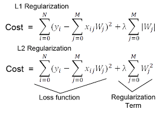
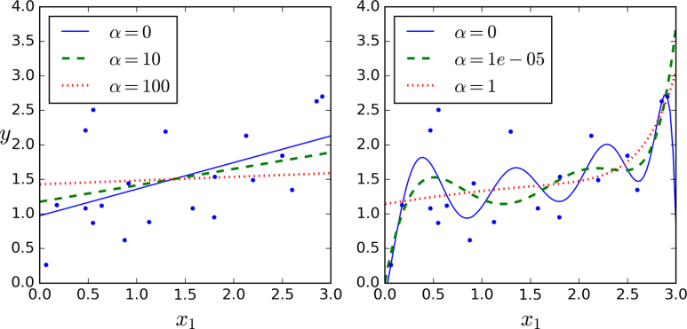
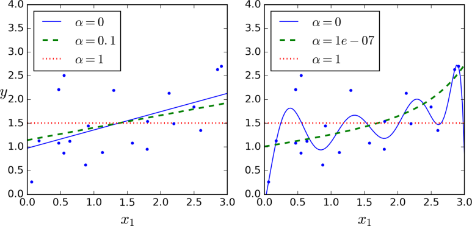

# 5.6 규제 선형 모델 - 릿지, 라쏘, 엘라스틱넷
## 규제 선형 모델 개요
- 기존 선형 모델 비용함수는 RSS를 최소화했기 때문에 학습 데이터에 맞춰져 변동성이 심해짐.
- 잔차 오류 값을 최소로 하는 RSS 최소화 방법과 과적합을 방지하기 위해 회귀 계수 값이 커지지 않도록 제어 필요 
- 규제(regularization) : 비용 함수에 alpha 값으로 패널티를 부여해 회귀 계수 값의 크기를 감소시켜 과적합을 개선하는 방식 (가중치 파라미터 값의 범위를 제한)

    - L2 규제 : 가중치의 제곱들의 합에 비례하는 비용을 손실함수에 추가
    - L1 규제 : 가중치의 절대값 합에 비례하는 비용을 손실함수에 추가
- L2 규제 적용한 회귀를 릿지(Ridge) 회귀라고 함
- L1 규제 적용한 회귀를 라쏘(Lasso) 회귀라고 함

## 릿지 회귀
- L2 규제가 비용함수에 추가된 모형
- 데이터를 맞추는 것 뿐 아니라 모델의 가중치를 작게 유지되도록 비용함수에 추가되어 학습
- 사이킷런의 Ridge 클래스를 통해 구현
- alpha로 규제 정도를 조절 
    - alpha = 0 이면 선형 회귀 모형과 같음
    - alpha 가 크면 가중치 파라미터가 0에 가까워짐
    
## 라쏘 회귀
- L1 규제가 비용함수에 추가된 모형
- 덜 중요한 가중치의 계수를 0으로 만들어 제거 가능하여 적절한 피처만 회귀에 포함시키는 피처 선택의 특성을 지님
- 사이킷런의 Lasso 클래스를 통해 구현 가능 
- alpha로 규제 정도 조절 

## 엘라스틱넷 회귀
- L2 규제와 L1 규제를 결합한 회귀
- 라쏘 회귀가 중요 피처를 선택하기 위해 다른 피처를 0으로 만들기 위해 회귀 계수 값의 변동성이 큰 단점을 개선하기 위해 L2 규제를 추가
- L2 규제, L1 규제가 모두 적용되며 수행시간이 오래 걸림
- 사이킷런의 ElasticNet 클래스로 구현 가능 
- 엘라스틱넷 규제 : a * L1 + b * L2
- alpha : a + b
- l1_ratio : a / (a+b)
- l1_ratio 가 0이면 a 도 0이므로 L2 규제와 동일, 1이면 L1 규제와 동일

## 선형 회귀 모델을 위한 데이터 변환 
- 선형 회귀 모델은 피처와 타깃값의 선형 관계가 있다고 가정
- 피처값과 타깃값의 분포가 정규 분포일 때 성능이 좋음
- 타깃값의 분포가 왜곡(skew)되었을 경우 예측 성능이 나빠짐
- 선형 회귀 모델 적용 전 데이터의 스케일링/정규화 과정 수행이 일반적
- 스케일링/정규화 과정
    (1) StandardScaler 클래스를 이용해 평균이 0, 분산이 1인 표준 정규 분포를 가진 데이터 세트로 변환 or MinMaxScaler를 이용해 최솟값이 0이고 최댓값이 1인 데이터세트로 변환
    (2) 다항 특성을 적용하여 변환. 1번 방법이 성능 향상 없을 경우 적용
    (3) log 함수 적용. (로그변환) 2번은 과적합 우려가 있고 1번보다 성능 향상이 잘 되어 많이 사용하는 변환 방법
- 일반적으로 타깃값의 경우 정규분포나 다른 정규값으로 변환하면 변환된 값을 다시 원복하기 어렵고, 로그 변환으로 예측 성능이 향상된 사례가 많기 때문에 로그 변환을 적용 