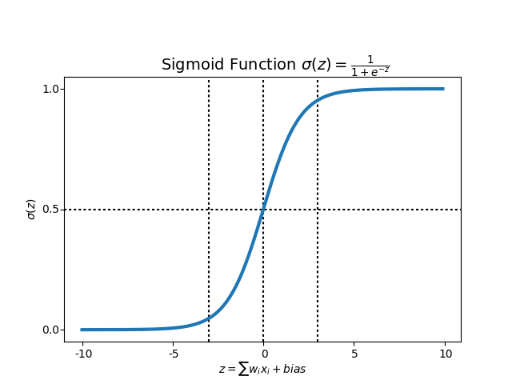
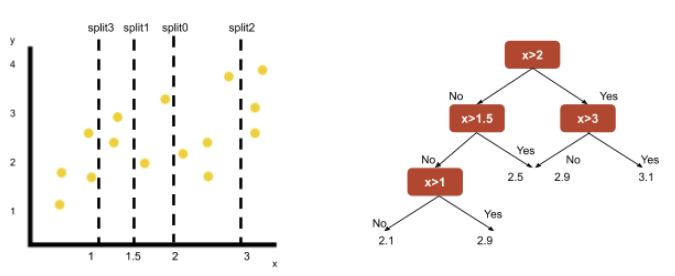

# 5.7 로지스틱 회귀
- 선형 회귀 방식을 분류에 적용한 알고리즘
- 시그모이드 함수 최적선을 찾고, 시그모이드 함수 반환 값을 확률로 간주에 확률에 따라 분류 결정
- 시그모이드 함수는 0~1 사이 값 반환
- x가 커지면 1에 근사, 작아지면 0에 근사, 0이면 0.5 반환
- 반환 값이 0.5보다 크면 양성(positive)로, 0.5보다 작으며 음성(negative)로 분류
- 

# 5.8 회귀 트리 
- 비선형 회귀는 회귀 계수의 결합이 비선형인 모형
- 회귀를 위한 트리를 생성하고 회귀 예측 
- 리프 노드에 속한 데이터 값의 평균값을 구해 회귀 예측값 계산

|알고리즘|회귀 Estimator 클래스|분류 Estimator 클래스|
|-|-|-|
|DecisionTree|DecisionTreeRegressor|DecisionTreeClassifier|
|GradientBoosting|GradientBoostingRegressor|GradientBoostingClassifier|
|XGBoost|XGBRegressor|XGBClassifier|
|LightGBM|LGBMRegressor|LGBMClassifier|
