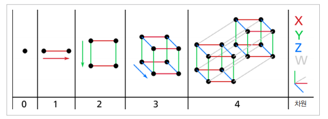
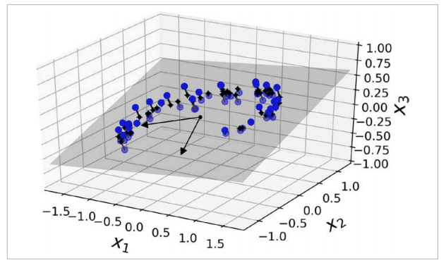
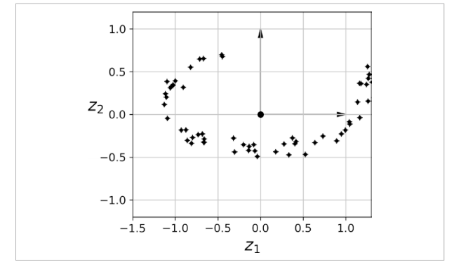
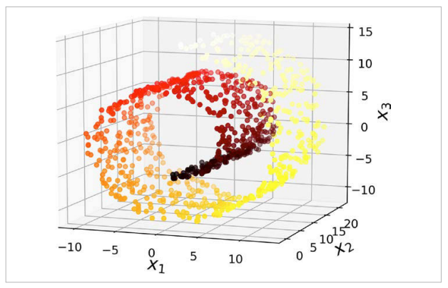
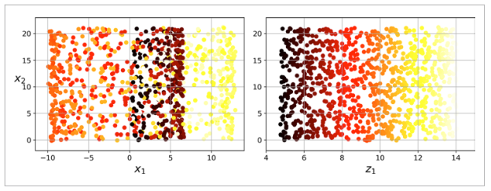
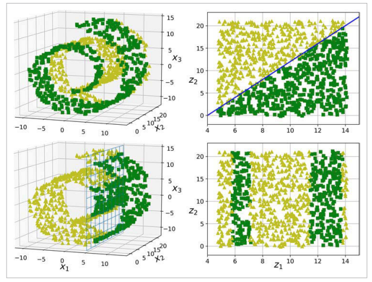
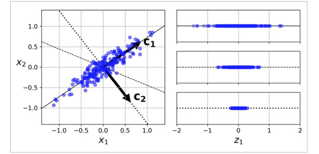
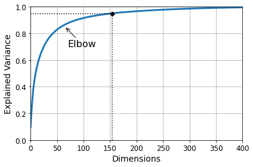
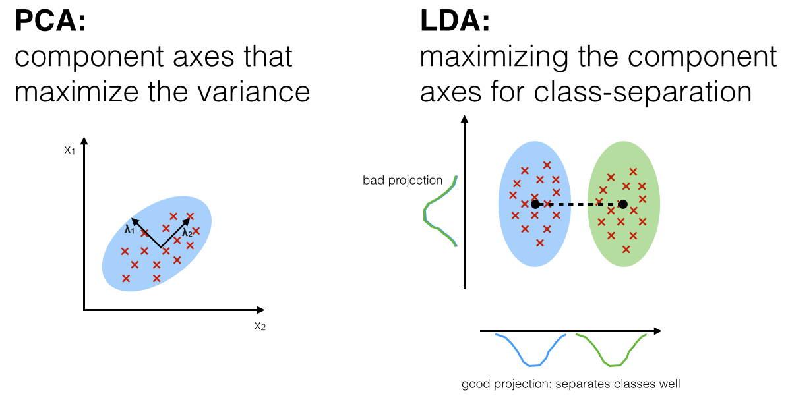

# 6.1 차원축소 개요 
- 차원축소 : 많은 피처를 가진 다차원 데이터를 축소해 새로운 차원의 데이터 세트를 생성하는 것 
- 차원 축소는 피처 선택(Feature Selection)과 피처 추출(Feature Extraction)으로 나뉨
- 피처 선택 
    - 특정 피처에 종속성이 강한 불필요한 피처 제거하여 주요 피처만 선택 
- 피처 추출 
    - 기존 피처를 저차원의 중요 피처로 압축해서 추출
    - 피처를 더 설명할 수 있는 다른 공간으로 매핑해 특징을 함축한 피처를 추출하는 것으로 기존 값과 완전히 다른 값 
    - 예) 모의고사 성적, 내신성적, 수능성적, 봉사활동, 대외활동, 학교 내외 수상경력 등 개별 피처를 학업 성취도, 커뮤니케이션 능력, 문제 해결력과 같은 함축적이고 학생 능력을 더 잘 설명할 수 있는 피처로 압축할 수 있음
    - 기존 피처가 발견하지 못한 잠재적인 요소(Latent Factor)를 추출 가능 
    - 피처 추출 알고리즘 : PCA, SVD, NMP 
    - 매우 많은 차원을 가진 텍스트나 이미지에서 활용
        - 이미지 : 이미지 데이터의 잠재 특성을 피처로 도출해 이미지 변환하게 되면 과적합 영향력이 작아져 예측 성능이 높아짐
        - 텍스트 : 텍스트 문서의 숨겨진 의미나 의도, 토픽 등을 추출 (SVD, NMF)

### 장점
**1. 차원의 저주 해결**
- 차원이 늘어나면 데이터 포인트 간 거리가 기하급수적으로 늘어나면서 희소한 구조를 지님 

    - 2차원에서 임의의 두 점을 선택했을 때 두 점 사이의 거리는 평균적으로 0.52인데, 1000000차원에서는 이것이 408.25까지 늘어남
    - 외삽(extrapolation : 관찰이 어려운 데이터에 대해 추측하는 것)을 요구하기 때문에 불안정
    - 고차원일수록 오버피팅 위험이 있음 
    - 이론적으로는 데이터의 거리를 가깝게 하도록 데이터의셋 크기를 키워 밀도를 sparce하지 않고 dense하게 만드는 것이 해결책
    - 하지만 필요한 데이터셋이 기하급수적으로 많아지기 때문에 차원축소를 통해 데이터 간 거리를 줄이는 것

**2. 데이터 시각화 용이**
- 차원 축소하면 시각화가 용이하여 시각적 패턴을 감지해 직관적으로 데이터 해석 가능

**3. 학습 시간 감소**
- 학습 데이터 크기가 줄어들어 학습에 필요한 자원도 줄일 수 있음

**4. 예측성능 향상**
- 피처가 많으면 상대적으로 예측 성능이 떨어지고, 개별 피처 간 상관관계가 높을 가능성이 커 다중공선성 문제 발생할 수 있음.


## 차원 축소를 위한 접근 방법
### 1) 투영
- 모든 데이터셋이 고르게 퍼져 있지 않고, 특정 피처 간 강하게 연관되어 있어 모든 데이터들이 고차원 공간 안에서 저차원 subspace에 놓여 있음
    - 3차원 공간 안에 있는 2차원 subspace
    
    - 모든 훈련 샘플을 subspace에 수직으로 투영하면 3차원에서 2차원으로 변환
    - 새로운 데이터셋은 새로운 축인 z1, z2에 대응됨
    
- 투영은 부분 공간이 뒤틀리거나 휘어 있는 데이터셋에는 적용이 어렵다는 단점이 있음 
    - 예) 스위스롤 데이터셋


    - 딘순히 평면에 투영시키면 층이 뭉개짐 
    - 오른쪽처럼 스위스롤이 펼쳐진 2차원 데이터셋을 얻기 위해서는 매니폴드 방법 필요

### 2) 매니폴드
**2차원 매니폴드**
- 스위스 롤은 2차원 매니폴드의 한 예 
- 2차원 매니폴드는 고차원 공간에서 휘어지거나 뒤틀린 2차원 모양
- d차원 매니폴드는 d차원 초평면으로 보일 수 있는 n차원 공간의 일부 (d<n)
- 스위스롤은 d=2, n=3으로 2차원으로 보이지만 3차원으로 말려져 있음 

**매니폴드 학습**
- 많은 차원 축소 알고리즘은 이러한 꼬여있는 매니폴드를 풀어헤친 형태를 모델링하는 식으로 작동하는데, 이를 매니폴드 학습(manifold learning)이라고 함
- 매니폴드 학습이 많이 활용되는 가장 큰 이유는 Classification이나 Regression같은 작업 시 저차원 매니폴드 형태로 데이터를 표현하면 훨씬 더 간단해질거라고 가정하기 때문 
- 항상 효과적이지는 않음 

    - 저차원에서 결정경계가 단순한 직선으로 간단해질 수도 있지만 오히려 고차원일때 결정경계가 단순하고 저차원으로 표현하면 더 복잡해질 수도 있음 
    - 데이터셋에 따라 차원축소의 유용성은 달라질 수 있음

# 6.2 PCA(Principal Component Analysis)
## PCA 개요
- 여러 변수 간 상관관계를 이용해 대표하는 주성분을 추출해 차원축소
- 정보 유실의 최소화를 위해 가장 높은 분산을 가지는 데이터의 축을 기준으로 차원 축소. 해당 축이 PCA의 주성분이 됨

    - 분산이 최대로 보존하는 축을 선택하는 것이 정보가 적게 손실
    - 분산이 최대로 보존하는 축=원본 데이터셋과 투영된 것 사이의 평균 제곱거리를 최소화하는 축
    - 분산이 최대인 축을 찾고, 첫 번째 축에서 직교하고 분산을 최대로 보전하는 두 번째 축을 찾고, 이전의 두 축에 직교하는 세 번째 축을 찾으며 차원의 수 만큼 n번째 축을 찾음.    
    - i번째 축을 데이터의 i번째 주성분(PC, pricipal Component)라 부름 
- 선형대수 관점에서 보면, 입력 데이터의 공분산 행렬을 고유값 분해하고, 구한 고유벡터에 입력 데이터를 선형 변환하는 것 
- **고유벡터가 PCA의 주성분 벡터**로, 입력 데이터의 분산이 큰 방향을 나타냄
- **고윳값은 고유벡터의 크기이며 입력 데이터의 분산**을 나타냄
    - 공분산 : 분산은 특정 한 개의 변수의 데이터 변동을 의미하지만, 공분산은 두 변수 간의 변동을 의미. 
        - Cov(키, 몸무게) > 0 : 키가 증가할 때 몸무게도 증가한다는 의미 
        - 공분산 행렬은 여러 변수와 관련된 공분산이 포함된 정방형 행렬(행, 열 개수 같음)이며 대칭 행렬(대각 원소 중심으로 원소 값이 대칭, $A^T=A$)
        - 공분산 행렬에서 대각선 원소는 각 변수의 분산을 의미하며 다른 원소는 모든 변수 간 공분산을 의미 
    - 고유벡터 : 행렬 A를 곱해도 방향이 변하지 않고 크기만 변하는 벡터 
        - Ax = ax (A:행렬, x:고유벡터, a:스칼라값)
        - 고유벡터는 여러 개 존재 가능하며 정방 행렬의 경우 최대 그 차원 수만큼 존재 가능
        - 고유벡터는 행렬이 작용하는 힘의 방향과관계가 있어 행렬을 분해하는데 사용됨 
        - 대칭행렬은 항상 고유벡터를 직교행렬로, 고유값을 정방 행렬로 대각화 가능 
        - 입력 데이터의 공분산 행렬 C를 분해 가능
        $$C=P\sum P^T$$
            - P : n X n 의 직교행렬 
            - $\sum$ :  n X n 정방행렬
            - $P^T$: 행렬 p의 전치행렬 
        - 공분산 C는 고유벡터 직교 행렬 x 고유값 정방 행렬 x 고유벡터 직교 행렬의 전치 행렬로 분해 됨 
        - **입력 데이터의 공분산 행렬이 고유벡터와 고유값으로 분해될 수 있으며, 이렇게 분해된 고유벡터를 이용해 입력 데이터를 선형 변환하는 방식이 PCA**
    - 선형변환 : 특정 벡터에 행렬 A를 곱해 새로운 벡터로 변환하는 것 (=특정 벡터를 다른 공간으로 투영)
        
- PCA 수행 방법 
    1) 입력 데이터 세트의 공분산 행렬 생성
    2) 공분산 행렬의 고유벡터와 고유값 계산 (고유값 분해)
    3) 고유값이 가장 큰 순으로 k개만큼 고유벡터 추출
    4) 고유값이 가장 큰 순으로 추출된 고유벡터를 이용해 새롭게 입력 데이터로 변환 


### 실습
- 사이킷런의 PCA 모델은 SVD(특이값 분해) 방법을 사용하여 구현
```python
from sklearn.decomposition import PCA

pca = PCA(n_components=2)
X2D = pca.fit_transform(X)

# 설명력
pca.explained_variance_ratio_

# 적절한 차원 수 설정 
cumsum = np.cumsum(pca.explained_variance_ratio_)
d = np.argmax(cumsum >= 0.95) + 1

# 압축과 복원 
pca = PCA(n_components=2)
x_reduced = pca.fit_transform(X)
x_recovered = pca.inverse_transform(x_reduced)
```

- 주성분의 설명된 분산의 비율은 explained_variance_ratio_ 변수에 저장되어 있으며, 해당 비율은 각 주성분의 축을 따라 나타나는 데이터 세트의 분산 비율을 나타냄 
- 축소할 차원 수를 선택할 때는 충분한 분산 (ex.95)이 될 때까지 선택 

- PCA 기반 차원 축소 후, inverse_transform 함수로 다시 복원 가능 


# 6.3 LDA(Linear Disciminant Analysis)
## LDA 개요
- 선현 판별 분석법이라 불리며, PCA와 유사하게 입력 데이터 세트를 저차원 공간에 투영해 차원 축소하는 기법
- 지도학습의 분류를 위해 개별 클래스를 분별하는 기준을 최대한 유지하며 차원을 축소
- 변동성이 가장 큰 축을 기준한 PCA와 다르게 입력 데이터의 결정 값 클래스를 분리할 수 있는 축을 기준으로 함. 
- 클래스 간 분산(between-class-scatter)과 클래스 내부 분산(within-class scatter) 비율을 최대화하는 방식으로 클래스 분리를 최대화하는 축을 찾음 (클래스 간 분산은 크게, 클래스 내부 분산은 작게)


## LDA 구하는 방법
1. 클래스 내부와 클래스 간 분산 행렬 계산 
2. 클래스 내부 행렬과 클래스 간 분산 행렬을 고유벡터로 분해 
3. 고유값이 가장 큰 순으로 k개(LDA 변환 차수) 추출
4. 고유값 가장 큰 순으로 추출된 고유벡터를 이용해 입력 데이터 변환 

### 활용
- 투영을 통해 클래스 간 거리를 멀리 떨어지게 하므로 SVM 분류기 같은 분류 알고리즘 적용 전 차원 축소하여 사용


---
참고
- 수식적 의미 : https://angeloyeo.github.io/2019/07/27/PCA.html 

