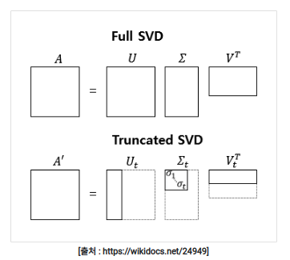
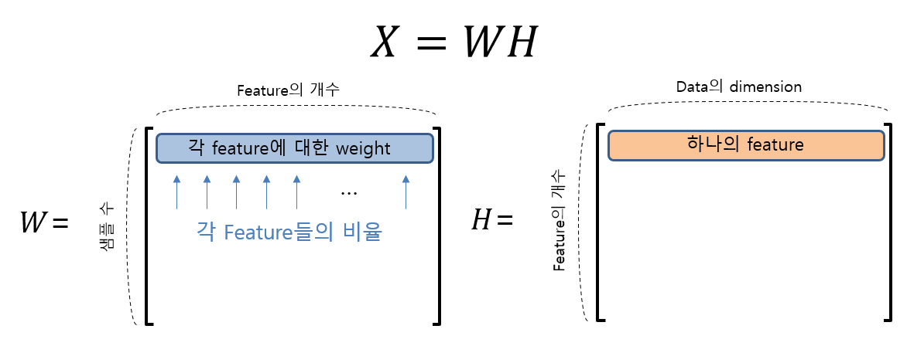

# 6.4 SVD(Singular Value Decomposition)
## SVD 개요
- 특이값 분해라고 불리며, PCA가 정방행렬만을 고유벡터로 분해했지만, SVD는 행과 열의 크기가 다른 행렬도 분해하여 차원 축소 
- m x n 크기의 임의의 사각 행렬 A를 특이 벡터(Singular vector)의 행렬과 특이값(Singular value)의 대각 행렬로 분해
- 특이값 분해 의미
    - 행렬의 크기 감소
    - 정방행렬이 아닌 행렬의 해를 구할 수 있음
    - 데이터의 크기를 줄여줌
- 특이값 분해를 하면 모든 성분이 가치가 높은 순으로 정렬되어 분해
- Truncated SVD : 특이값 대각행렬에서 특이값이 0인 부분도 제거하고 제거된 대각행렬에 대응되는 특이벡터도 제거하여 SVD 적용
- 가치가 낮은 부분은 truncate로 제거, 그리고 다시 복원

$$A=U\sum V^T$$
    - $U$, $V$ : 특이벡터
    - $\sum$ : 대각행렬 (대각에 위치한 값을 제외하고 모두 0)
        - 0이 아닌 대각선에 놓인 값들을 특이값이라고 부름 

# 6.5 NMF(Non-Negative Matrix Factorization)
## NMF 개요
-  낮은 랭크를 통한 행렬 근사 방식의 변형 
- 원본 행렬 내 모든 원소 값이 모두 양수라면 두 개의 양수 행렬로 분해 가능 

## 활용
- 이미지 압축을 통한 패턴 인식, 텍스트의 토픽 모델링 기법, 문서 유사도 및 클러스터에 사용
- 영화 추천과 같은 추천
    - 상품 평가 데이터 세트(사용자-평가 순위)를 행렬 분해 기법을 통해 분해하며 사용자가 평가하지 않은 상품에 대한 잠재적은 요소를 추출해 평가 순위를 예측하고 높은 순위대로 추언 (Latent Factoring 기반 추천 방식이라 함)
