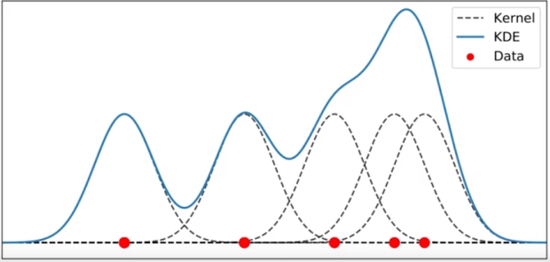
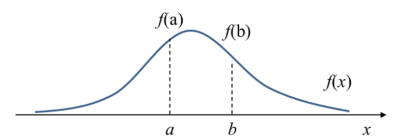
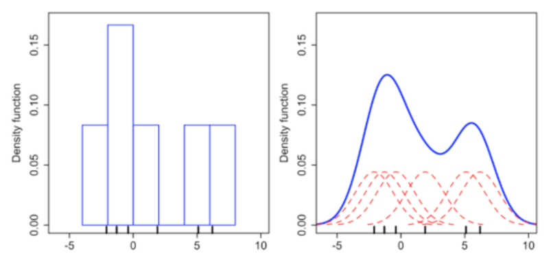
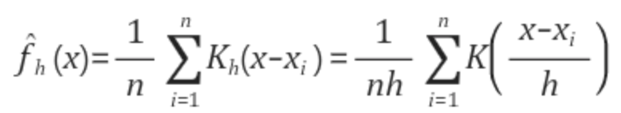
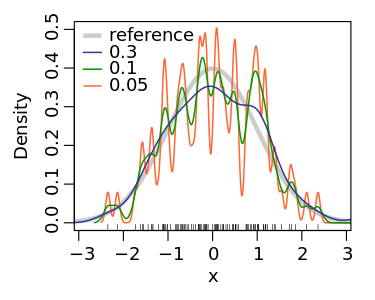
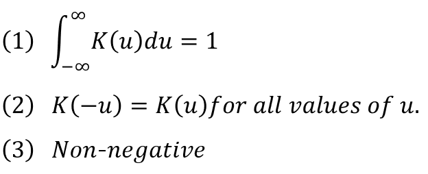
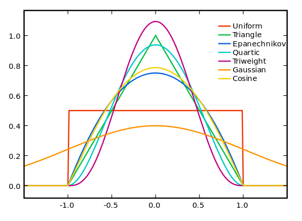
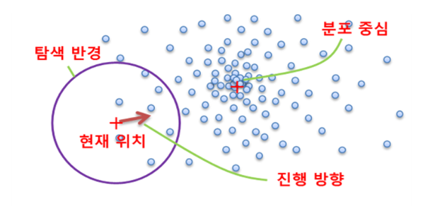

# 7.3. 평균이동
## 7.3.1. 개요 
- 중심을 데이터가 모여 있는, 밀도가 높은 곳으로 군집의 중심을 지속적으로 움직이면서 군집화 수행하는 방법
    - 참고) K-평균 : 중심에 소속된 데이터의 평균 거리 중심으로 군집화 수행
- 확률 밀도 함수를 이용해 데이터 분포를 고려해 군집 중심점을 찾음
- 가장 데이터가 모여 있는 곳 = 확률 밀도 함수가 피크인 점 = 군집 중심점 
- 확률 밀도 함수를 찾기 위해 KDE(Kenel Density Estimation) 이용
- 정형 데이터보다 이미지나 영상 데이터에서 특정 개체를 구분하거나 움직임을 추적하는데 뛰어난 역할 수행 


### KDE(Kernel Density Estimation, 커널 밀도 추정)

- **커널함수를 통해 어떤 변수의 확률 밀도 함수를 추정**하는 대표적인 방법. 
    - 밀도추정 : 관측된 데이터들의 분포로 원래 변수의 확률 분포 특성을 추정 
    - 확률밀도 f(a)는 변수 x가 a라는 값을 가질 상대적인 가능성, 확률을 나타냄 
        
- 비모수(non-parametric) 밀도추정 방법 중 하나 
    - 비모수 추정 : 데이터가 특정 분포를 따르지 않는다는 가정으로, 사전 정보없이 순수하게 관측된 데이터만으로 추정
- 커널함수를 이용해 히스토그램 방법의 문제점을 개선한 방법
    - bin 경계에서의 불연속성, bin의 크기 및 시작 위치에 따라 히스토그램 바뀜, 고차원 데이터의 메모리 문제 등

- 확률 밀도 함수(PDF, Probability Density Function)는 확률 변수의 분포를 나타내는 함수로, 정규분포 함수, 감마 분포, t-분포 등이 있음 
- 확률 밀도 함수를 통해 특정 변수가 어떤 값을 가질지에 대한 확률을 알게 되므로 변수의 특성과 확률 분포 등 변수에 대해 파악할 수 있음
- 관측된 데이터 각각에 커널 함수를 적용한 값을 모두 더한 뒤 데이터 건수로 나눠 확률 밀도 함수 추정 
    
    - $x$ : 확률 변수값, $x_{i}$ : 관측값
    - $k$ : 커널 함수, $h$ : 대역폭(bandwidth)
- $h$는 KDE 형태를 부드럽게 혹은 뾰족하게 변경하는 평활화 시키는 파라미터로 대역폭(h)에 따라 군집 수가 달라지므로 평균이동에서 매우 중요한 파라미터. (군집 수 지정x)
    
    - 대역폭이 클수록 KDE가 평활화되기 때문에 적은 수의 군집 중심점을 가지며 과소적합 위험
    - 대역폭이 적으면 좁고 뾰족한 KDE를 가지며, 변동성이 큰 방식이기 때문에 과적합 위험. 많은 수의 군집 중심점을 가짐. 
    - 최적의 대역폭 계산 : estimate_bandwidth() 
- 커널 함수 종류
    - 위키피디아 참고 : https://en.wikipedia.org/wiki/Kernel_(statistics)#Kernel_functions_in_common_use
    - 커널 함수란 (1) 적분값이 1이며, (2) 원점을 중심으로 대칭인 (3) Non-negative인 경우를 만족하는 함수를 의미 
        
    - 대표적인 커널 함수로 가우시안 분포 함수가 사용됨. 
    

## 7.3.2. 동작방식

1. 초기 군집 중심점과 대역폭 설정. 주변 데이터 분포도(밀도)를 KDE 사용하여 계산 

2. 대역폭 내에 데이터 밀도가 높은 곳으로 중심점 이동

3. 이동한 중심점에서 대역폭 내의 데이터 밀도 측정

4. 대역폭 내의 데이터 밀도가 높은 곳으로 중심점 이동

5. 지속적인 반복을 통해 가장 데이터 밀도가 높은 peak 지점을 기준으로 군집화 수행

6. peak 지점을 찾으면 수행 중지, 아니면 2~4 과정 반복


## 7.3.3. 특징 
### 장점
- 데이터셋의 형태를 특정 형태나 모델을 가정하지 않기 때문에 유연한 군집화 가능
- 이상치 영향력이 크지 않음
- 군집 개수를 사전에 설정할 필요 없음 

### 단점 
- 대역폭의 크기에 따라 군집화 품질이 결정됨
- 알고리즘 수행 시간이 오래 걸림 

## 7.3.4. 예제 
- make_blobs()을 이용해 2개의 feature와 3개의 군집을 가진 임의의 데이터 200개를 생성하여 사이킷런의 MeanShift를 이용해 군집화 수행  
```python
import numpy as np
from sklearn.datasets import make_blobs
from sklearn.cluster import MeanShift

X, y = make_blobs(n_samples=200, n_features=2, centers=3, 
                  cluster_std=0.7, random_state=0)

meanshift= MeanShift(bandwidth=0.8)
cluster_labels = meanshift.fit_predict(X)
print('cluster labels 유형:', np.unique(cluster_labels))
```
- bandwidth 최적화 -> estimate_bandwidth() 
```python
from sklearn.cluster import estimate_bandwidth

bandwidth = estimate_bandwidth(X)
print('bandwidth 값:', round(bandwidth,3))
```


 