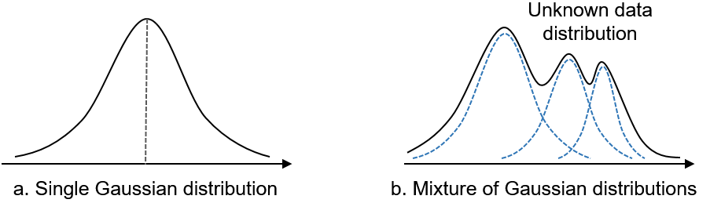

# 7.4 GMM(Gaussian Mixture Model)
## 7.4.1 개요 
- 군집화를 적용하고자 하는 데이터가 여러 개의 가우시안 분포를 가진 데이터 집합들이 섞여서 생성된 것이라 가정하에 군집화 수행 


#### 가우시안 분포 

- 정규분포라고도 부름
- 좌우 대칭형의 종 모양 형태의 연속 확률 함수
- 평균이 0이고, 표준편차가 1인 정규 분포를 표준 정규 분포라고 함 

## 7.4.2 작동방식
1. 데이터가 여러 개의 가우시안 분포가 섞인 것으로 간주하기 때문에, 데이터 분포에서 개별 유형의 가우시안 분포를 추출(평균과 분산)
2. 개별 데이터가 특정 정규 분포에 해당할 확률 구하기 
3. 여러 개의 정규 분포 중 어디에 속하는지 결정
- (1) 개별 정규 분포의 평균과 분산, (2) 각 데이터가 어떤 정규 분포에 해당하는지의 확률. 두 가지 모수 추정에 EM(Expectation and Maximization) 방법 적용 
- 사이킷런의 GaussianMixture 클래스 사용 

## 7.4.3 특징 
### 장점
- k-means 보다 유연하게 다양한 데이터세트에 적용할 수 있음 
    - k-means는 원형 형태로 분산된 데이터를 효과적으로 군집화. 길쭉한 형태는 군집화 어려움. 

### 단점
- 시간이 오래 걸림 
- 클러스터 개수(n_components)를 지정해줘야 함

## 7.4.4 예제 
```python
from sklearn.datasets import load_iris
from sklearn.cluster import KMeans

import matplotlib.pyplot as plt
import numpy as np
import pandas as pd
%matplotlib inline

iris = load_iris()
feature_names = ['sepal_length','sepal_width','petal_length','petal_width']

# 보다 편리한 데이타 Handling을 위해 DataFrame으로 변환
irisDF = pd.DataFrame(data=iris.data, columns=feature_names)
irisDF['target'] = iris.target

from sklearn.mixture import GaussianMixture

gmm = GaussianMixture(n_components=3, random_state=0).fit(iris.data)
gmm_cluster_labels = gmm.predict(iris.data)

# 클러스터링 결과를 irisDF 의 'gmm_cluster' 컬럼명으로 저장
irisDF['gmm_cluster'] = gmm_cluster_labels
irisDF['target'] = iris.target

# target 값에 따라서 gmm_cluster 값이 어떻게 매핑되었는지 확인. 
iris_result = irisDF.groupby(['target'])['gmm_cluster'].value_counts()
print(iris_result)
```