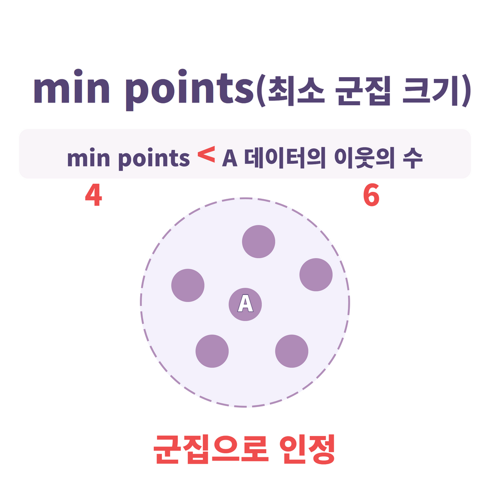
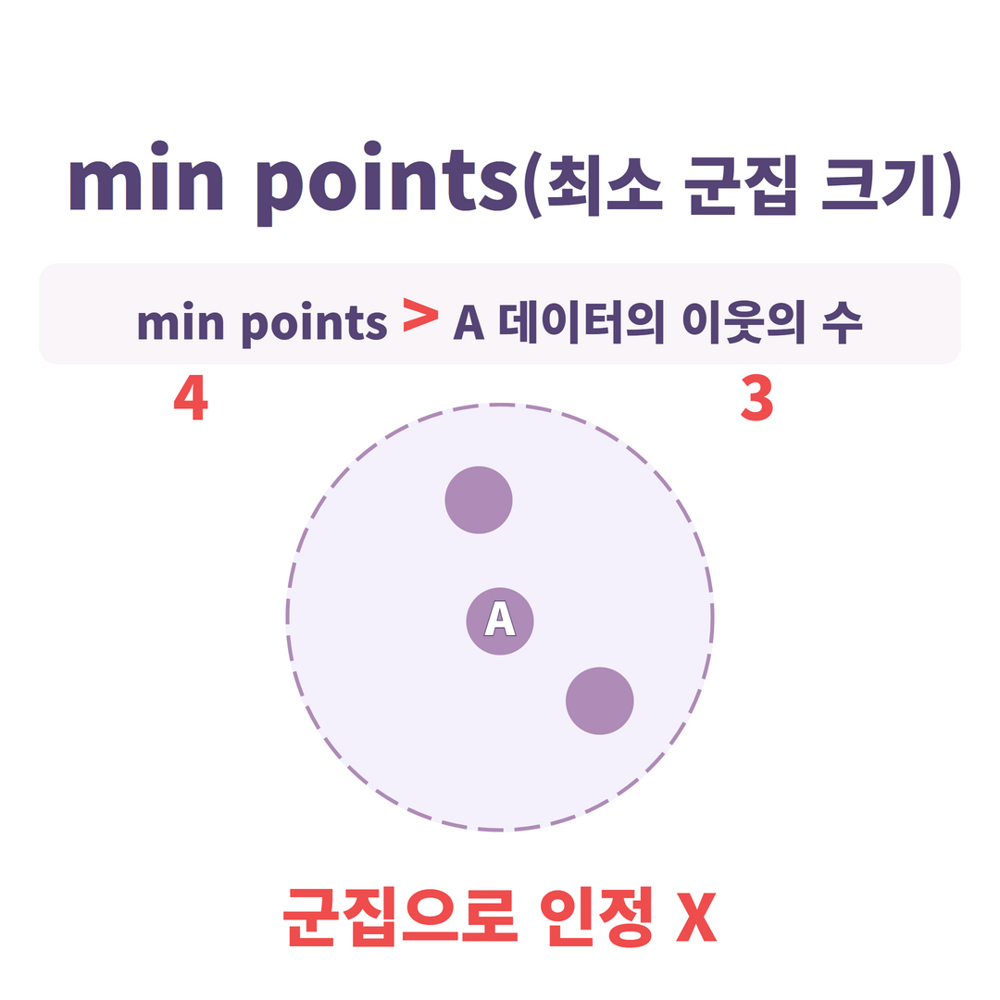
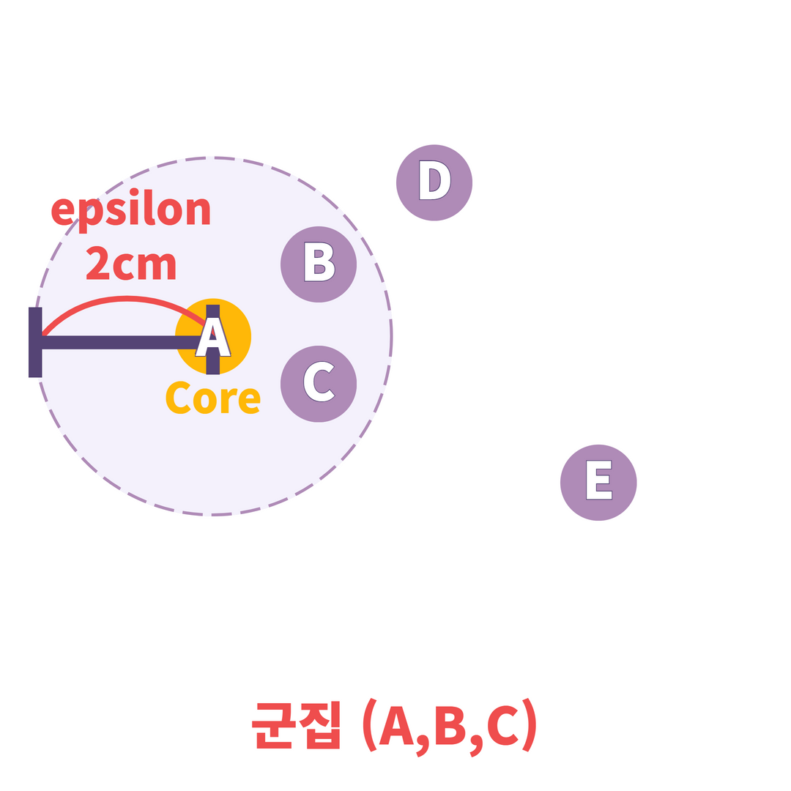
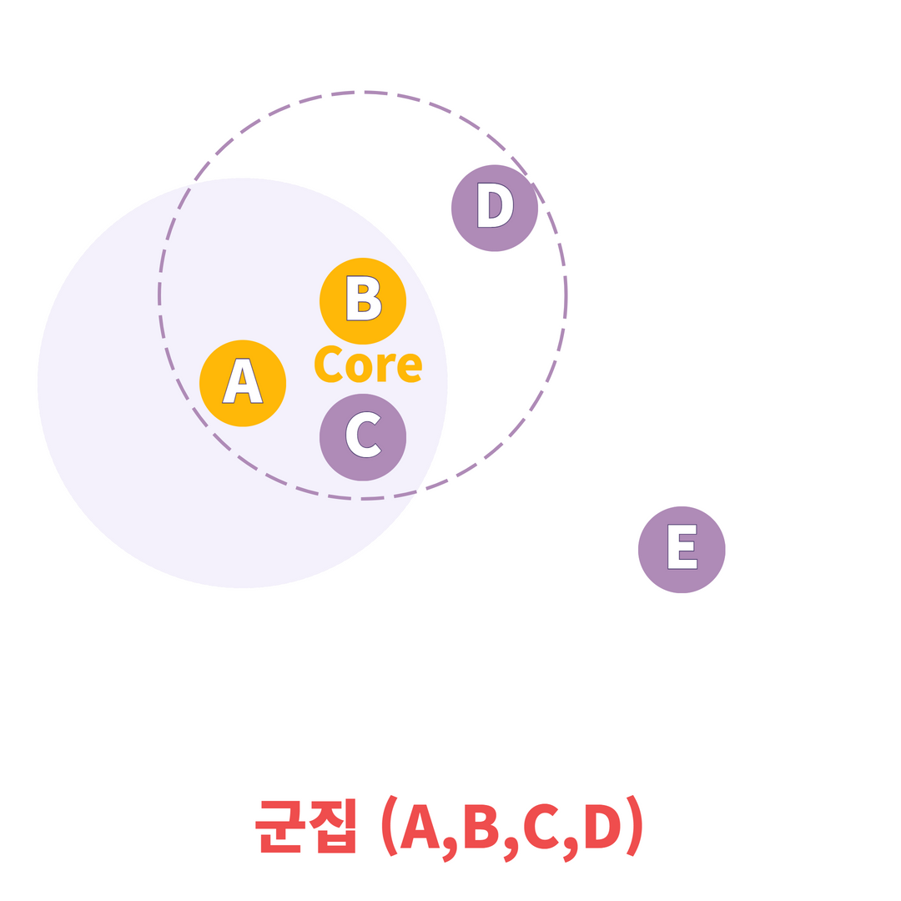
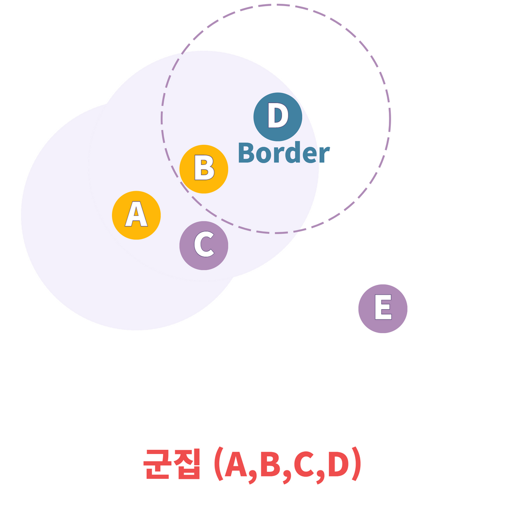
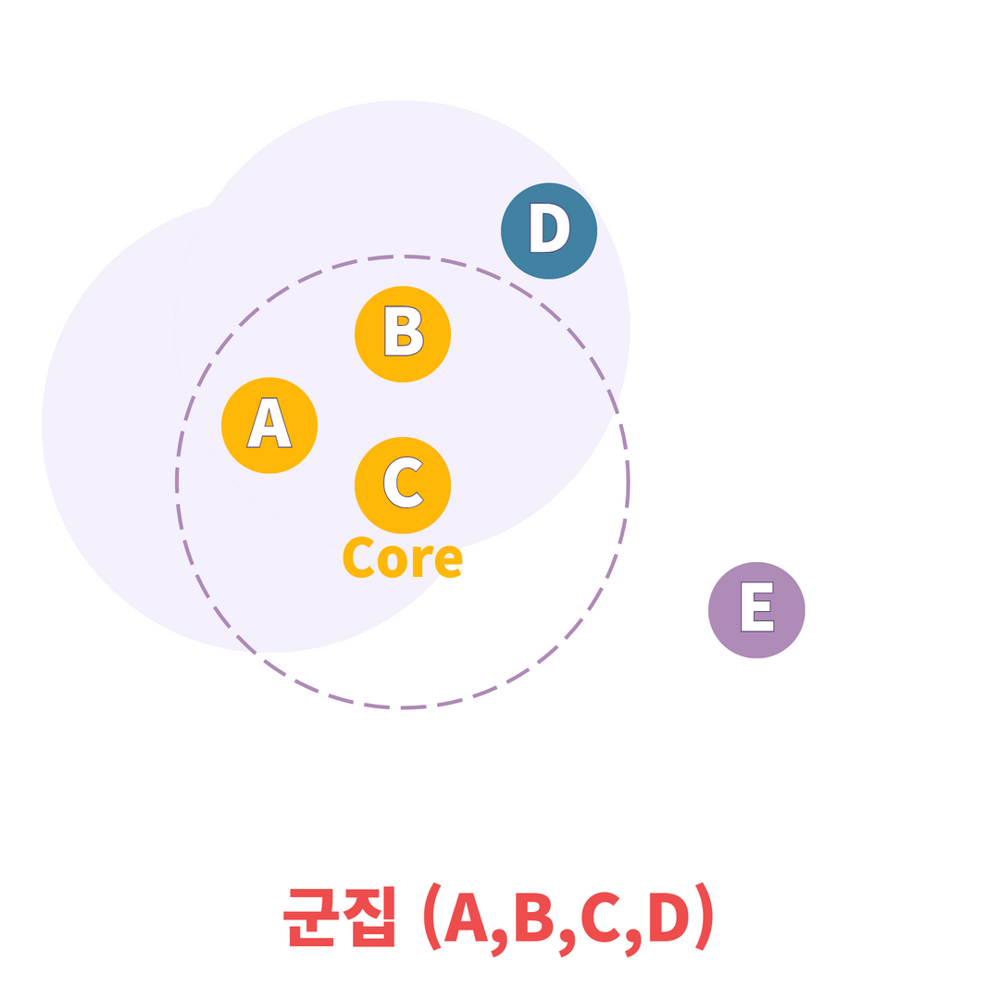
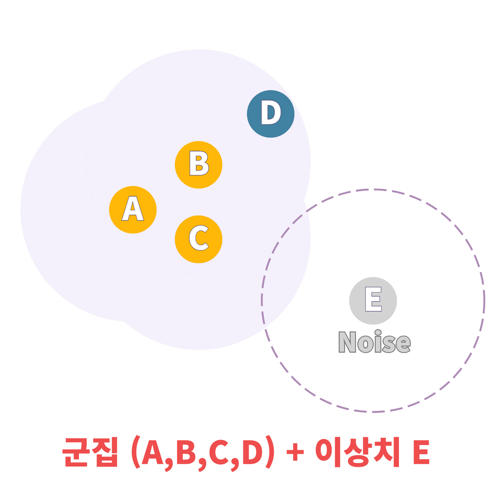
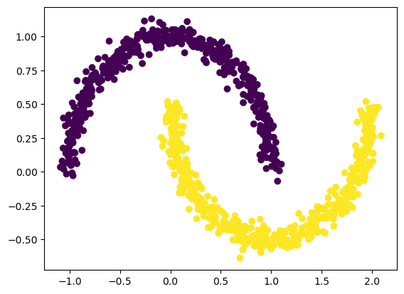

# 7.5 DBSCAN
## 7.5.1 개요 
- 특정 공간 내 데이터 밀도 차이 기반 군집화 수행 

 | 
---|---|
- 두가지의 하이퍼파라미터 가짐 
    - 입실론 주변 영역(epsilon) : 개별 데이터를 중심으로 입실론 반경을 가지는 원형의 영역
    - 최소 데이터 개수(min points) : 개별 데이터의 입실론 주변 영역에 포함되는 타 데이터 개수 
- 데이터 포인트 
    - 핵심 포인트(core) : 주변 영역 내에 최소 데이터 개수 이상 타 데이터를 가지고 있는 데이터 
    - 이웃 포인트(neighbor) : 주변 영역 내 위치한 타 데이터 
    - 경계 포인트(border) : 주변 영역 내 최소 데이터 개수 이상 이웃 포인트를 가지고 있지 않지만 핵심 포인트를 이웃 포인트로 가지고 있는 데이터 
    - 잡음 포인트(noise) : 최소 데이터 개수 이상의 이웃 포인트를 가지고 있지 않으며, 핵심 포인트도 이웃 포인트로 가지고 있지 않은 데이터 

## 7.5.2 특징
#### 장점 
- 간단하고 직관적인 알고리즘 
- 데이터 분포가 기하학적으로 복잡한 데이터 세트도 효과적으로 군집화 수행 
- 클러스터 개수 지정 필요 없음 
- 모든 클러스터가 충분히 밀집되어 있고, 밀집되지 않은 지역과 잘 구분될 때 좋은 성능을 가짐 

#### 단점 
- 데이터 밀도가 자주 변하거나, 모든 데이터 밀도가 비슷하면 성능이 떨어짐
- 특성 개수가 많으면 성능 떨어짐 
- 새로운 샘플에 대해 cluster 예측 못함 

## 7.5.3 작동방법
1. 데이터 중, 임의의 포인트를 선택
2. 선택한 데이터와 Epsilon 거리 내에 있는 모든 데이터 포인트를 찾음.
3. 주변에 있는 데이터 포인트 갯수가 Min Points 이상이면, 해당 포인트를 중심으로 하는 Cluster를 생성
4. 어떠한 포인트가 생성한 Cluster 안에 존재하는 다른 점 중, 다른 Cluster의 중심이 되는 데이터 포인트가 존재한다면 두 Cluster는 하나의 Cluster로 간주
5. 1~4번을 모든 포인트에 대해서 반복
6. 어느 Cluster에도 포함되지 않는 데이터 포인트는 이상치로 처리 
#### DBSCAN 예시 (eplison=2, min points=3)
||데이터 A 중심으로 입실론 안의 이웃 수 > 최소 이웃 수 =>군집 생성|
|--|--|
|| 데이터 B 중심으로 이웃 4개 => 군집 생성, A 군집에 D 데이터 추가|
|| 데이터 D 중심으로 이웃 2개 => 군집 생성 x. core 데이터 B를 이웃으로 하고 있어 확장을 멈추고, D를 군집에 포함시킴. Border가 됨.|
||데이터 C 중심 이웃 3개 => 군집 생성. C는 중심점이 됨|
||데이터 E 중심 이웃 0개, 중심점이 이웃이 아니므로 E는 이상치가 됨|


## 7.5.4 예제
```python
from sklearn.datasets import make_moons
from sklearn.cluster import DBSCAN
import matplotlib.pyplot as plt

N = 1000

X, y = make_moons(n_samples=N, noise=0.05) # make_moons 함수를 사용

dbscan = DBSCAN(eps=0.2, min_samples=5) # DBSCAN (eps : epsilon, min_samples : min point)
dbscan.fit(X)

plt.scatter(X[:, 0], X[:, 1], c=dbscan.labels_) # Clustering 결과 시각화 
plt.show()

``` 


---
참고 
- https://ablearn.kr/newsletter/?idx=13581593&bmode=view