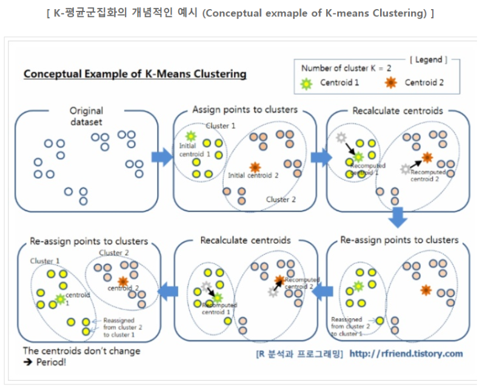
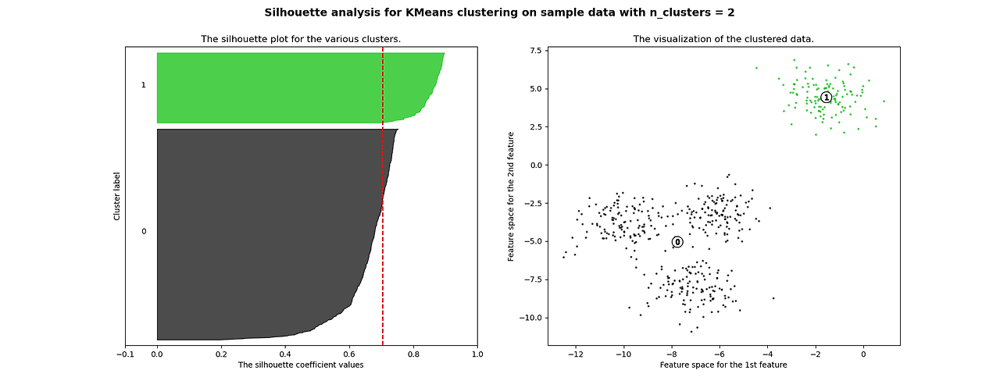
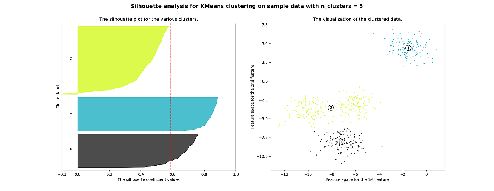
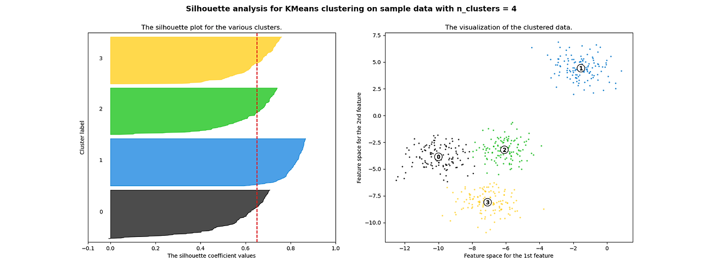

# 7.1 k-평균 알고리즘의 이해
- 특정 임의의 지점을 선택해 해당 중심에 가장 가까운 포인트를 선택하는 군집화 기법
- 군집 중심점은 선택된 포인트의 평균 지점으로 이동하고, 이동된 중심점에서 다시 가까운 포인트를 선택하는 과정 반복
- 더이상 중심점 이동이 없을 경우 반복을 멈추고 중심점에 속하는 데이터 포인트를 군집화 

## k-평균 장단점
- 장점 
    - 일반적인 군집화에 많이 활용
    - 알고리즘이 쉽고 간결
- 단점
    - 거리 기반 알고리즘으로 속성의 개수가 많으면 군집화 정확도 떨어짐
    - 반복 수행으로 반복 횟수가 늘어나면 수행 시간이 느려짐
    - 몇 개의 군집을 선택할 지 정하기 어려움 

### 실습
```python
from sklearn.cluster import KMeans
kmeans_model = KMeans(n_clusters = 4,max_iter = 10)
kmeans_model.fit(X)
```

## 군집화 알고리즘 테스트를 위한 데이터 생성
- 군집화용 데이터 생성기 : make_blobs(), make_classification()
- 여러 개 클래스 데이터셋 생성 가능하며, 한 클래스에 여러 군집이 분포되게 생성 가능 
- make_blobs()은 개별 군집의 중심점과 표준 편차 제어 기능 추가
- make_classification() 은 노이즈를 포함한 데이터셋 생성 가능 

# 7.2 군집 평가 
- 군집화 데이터 세트는 분류 처럼 타깃 레이블을 가직고 있지 않고, 데이터 내 별도의 그룹을 찾거나 더 세분화된 군집화를 추구하는 등 다른 성격을 지님 
- 군집화가 효율적으로 평가하는 것은 어렵지만 일반적으로 실루엣 분석을 사용
## 실루엣 분석 
- 각 군집 간의 거리가 얼마나 효율적으로 분리되었는지 나타냄
- 실루엣 계수 : 같은 군집 내 데이터와 얼마나 가깝고, 다른 궂비과 얼마나 멀리 분리되어 있는지 나타내는 지표 
- 실루엣점수:모든 샘플에 대한 실루엣계수의 평균값
- 실루엣 계수 
$$s(i) = \frac {b(i)-a(i))}{(max(a(i),b(i))}$$
    - a : 클러스터 내부 점들 간의 평균거리
    - b : 가장 가까운 클러스터의 샘플까지 평균거리
-  -1≦실루엣점수≦+1 
    - +1:해당 샘플이 클러스터에 잘 속함 &다른 클러스터와 떨어져 있음
    - 0:클러스터의 경계에 위치 
    - 1 : 잘못된 클러스터에 할당됨
- sklearn.metrics.silhouette_samples() : 각 데이터 포인트의 실루엣 계수 반환 
- sklearn.metrics.silhouette_score(): 전체 데이터의 실루엣 계수의 평균값 반환. 이 값이 높다고 항상 군집화가 잘 된 것은 아님. 



    - 2개로 했을 때, 실루엣 점수는 높지만 시각화해서 봤을 때 내부 데이터가 많이 떨어져 있는 것을 확인 가능 