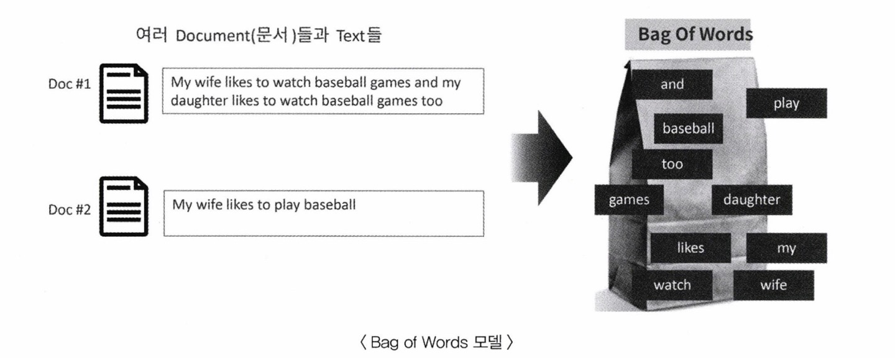
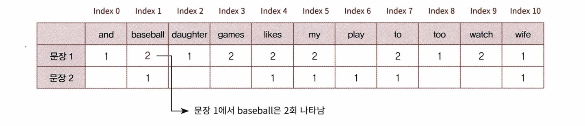
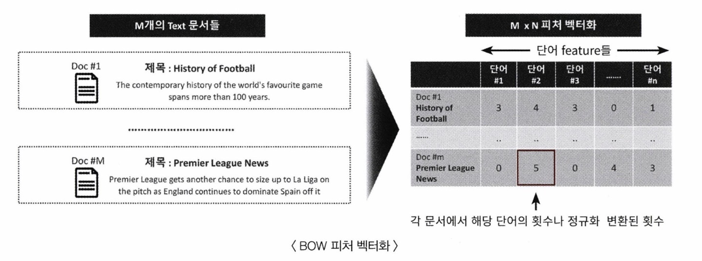
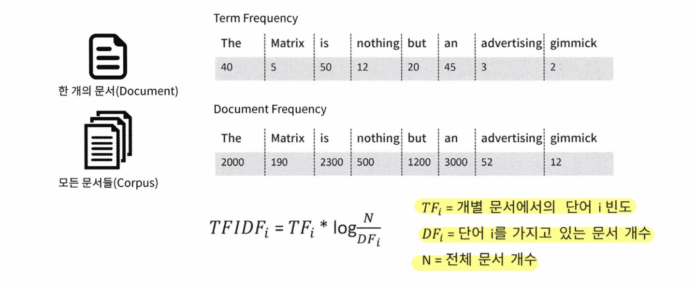
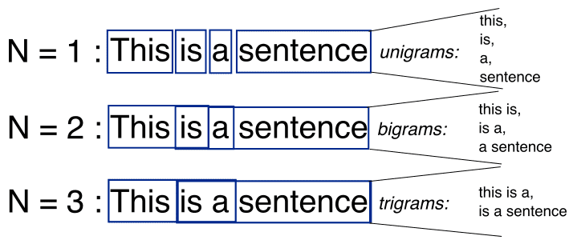

## 8.3 BOW(Bag of Word)
- 문서가 가지는 모든 단어를 문맥이나 순서를 무시하고 일괄적으로 단어에 빈도값을 부여해 피처 값을 추출하는 모델 
- 감자튀김에 양념을 넣고 섞듯이 모든 단어를 한꺼번에 봉투(bag)에 담고 흔들어서 섞는다는 의미로 Bag of Words 모델이라 부름

- 예시 
    >  - 문장 1 : My wife likes to watch baseball games and my daughter likes to watch baseball games too
    > - 문장 2 : My wife likes to play baseball 
    1) 문장 1, 2에 있는 모든 단어에서 중복을 제거하고 각 단어를 칼럼 형태로 나열함. 그리고 나서 각 단어에 고유의 인덱스를 부여. 
        - 'and':0, 'baseball':1, 'daughter':2 ... 
    2) 개별 문장에서 해당 단어가 나타나는 단어 횟수를 각 단어에 기재. 

- 장점
    - 쉽고 빠른 구축 가능 
    - 단어의 발생 횟수 기반이지만 문서의 특징을 잘 나타내 여러 분야에 활용도 높음
- 단점
    - 문맥의미(semantic context) 반영 부족 : 단어 순서를 고려하지 않아 문장 내 단어의 문맥적 의미가 무시됨. n_gram을 사용해도 제한적이므로 문맥적 해석을 처리하지 못함. 
    - 희소 행렬 문제 : 희소 행렬 형태의 데이터 세트가 만들어짐. 문서 내 추출되는 단어가 칼럼으로 만들어지고, 한 문서에 속하는 단어는 일부기 때문에 대부분의 데이터가 9으로 채워짐. 이렇게 0으로 채워지는 행렬을 희소행렬이라 부르며, ML 알고리즘의 수행시간과 예측 성능을 떨어뜨림. 
### BOW 피처 벡터화 
- 텍스트를 특정 의미를 가지는 숫자 값인 벡터 값으로 변환하는 작업 
- 각 문서의 텍스트를 단어로 추출해 피처로 할당하고, 각 단어의 발생 빈도와 같은 값을 피처에 값으로 부여하여 각 문서를 단어 피처의 발생 빈도 값으로 구성된 벡터로 변환하는 기법
- 피처 벡터화는 넓은 의미에서 다른 형태의 피처 조합으로 변경하는 것이기 때문에 피처 추출에 포함됨. 
- BOW 피처 벡터화 : 모든 문서에서 모든 단어를 칼럼 형태로 나열하고, 각 문서에서 해당 단어의 횟수나 정규화된 빈도를 값으로 부여하는 데이터 세트 모델로 변경하는 것 
    - 예) M개의 문서, 모든 문서에서 N개의 단어가 있으면, M*N개의 단어 피처로 이루어진 행렬이 구성됨 
    
- BOW 피처 벡터화 방식 
    (1) 카운트 기반의 벡터화
    - 각 문서에서 해당 단어가 나타나는 횟수(count)를 부여하는 경우 

    (2) TF-IDF(Term Frequency - Inverse Document Frequency)
    - 개별 문서에서 자주 나타나는 단어에 높은 가중치를 주되, 모든 문서에서 전반적으로 자주 나타나는 단어에 대해 패널티 주는 방식으로 값 부여
    - 문서에서 특정 단어가 자주 나타나면 해당 문서를 특징짓는 중요 단어일 수 있으나, 다른 문서에서도 자주 나타나면 범용 단어일 가능성이 높음. (e.g. 많은, 당연히, 업무 등)
    - 문서마다 텍스트가 길고, 문서 개수가 많으면 카운트 방식보다 TF-IDF 방식이 더 좋은 예측 성능을 보장함. 
     

### 사이킷런의 Count 및 TF-IDF 벡터화 구현 : CountVectorizer, TfidfVectorizer 
- 사이킷런의 CountVectorizer 
    - 카운트 기반 벡터화 구현한 클래스
    - 피처 벡터화 외 소문자 일괄 변환, 토큰화, 스톱워드 필터링 등 텍스트 전처리도 수행 
    - fit(), transform() 통해 피처 벡터화된 객체 반환
    - 입력 파라미터 

| 파라미터 명 | 파라미터 설명 |
| --- | --- |
|max_df|전체 문서에서 너무 많은 빈도수를 가지는 단어 피처를 제외하기 위해 해당 값 이하로 나타난 단어만 피처로 추출. 예)100 : 100개이하 나타난 단어만 피처로 추출, 0.95(0~1 사이 부동소수점): 빈도수의 95%까지 단어만 피처로 추출|
|min_df|전체 문서에서 너무 낮은 빈도수를 가지는 단어 피처를 제외하기 위해 설정된 값보다 적은 빈도수를 가지면 중요하지 않거나 가비지성 단어로 생각하고 추출하지 않음. 정수 값을 가지면 해당 빈도수 이하의 단어를, 부동소수점이면 전체 문서에서 해당 비율 이하의 빈도수를 가지는 단어를 추출하지 않음.|
|max_features|추출하는 피처 개수 제한. 2000일 경우 가장 높은 빈도 순으로 정렬 후 2000개까지만 피처 추출|
|stop_words|'english'로 지정 시 영어의 스톱 워드로 지정된 단어는 추출하지 않음|
|n_gram_range|단어 순서를 보강하기 위해 n_gram 범위 설정. 튜플 형태로 (범위 최솟값, 최댓값) 지정. 예를 들어, (1, 2) : 단어를 1개씩, 그리고 순서대로 2개씩 묶어서 피처 추출|
|analyzer|피처 추출 수행 단위 지정. default='word' character의 특정 범위로 피처로 만드는 경우 다르게 지정|
|token_pattern|토큰화 수행하는 정규표현식 지정. default='\b\w\w+\b'. 공백 또는 개행 문자 등으로 구분된 단어, 단어 분리자 사이의 2문자 이상의 단어를 토큰으로 분리. 거의 default 변경하지 않음.|
|tokenizer|토큰화를 별도의 커스텀 함수로 이용시 적용. CountTokenizer 클래스에서 어근 변환 시 별도의 함수를 해당 파라미터에 적용|



- CountVectorizer 클래스를 이용해 카운트 기반 피처 벡터화 방법 
    (1) 사전 데이터 가공 : 소문자 변환 등 전처리 작업 수행 (default : lowercase=True)
    (2) 토큰화 : 단어 기준으로 n_gram_range 반영하여 토큰화 
    (3) 텍스트 정규화 : stop_words 필터링 
    - Stemming, Lemmatization 같은 어근 변환은 CountVectorizer 에서 지원 x. tokenizer 파라미터에 커스텀 어근 변환 함수 적용하여 수행 가능.

    (4) 피처 벡터화 : max_df, min_df, max_features 등의 파라미터를 이용해 토큰화된 단어를 피처로 추출하고 단어 빈도수 벡터 값 적용 

### BOW 벡터화를 위한 희소 행렬
- counterVectorizer/TfidfVectorizer를 이용해 텍스트를 피처 단위로 벡터화해 변환하고 CSR 형태의 희소 행렬을 반환하게 됨
- 모든 문서에 있는 단어를 중복 제거해도 피처로 만들면 칼럼 수가 매우 많아지지만 각 문서가 가지는 단어 수는 적어 행렬 대부분의 값이 0이 됨. 
- 이처럼, 대부분의 값이 0이 되는 행렬을 희소행렬이라 하며, BOW 형태를 가진 언어 모델의 피처 벡터화는 대부분 희소행렬임. 
- 희소행렬은 불필요한 0값이 메모리 공간에 할당되어 메모리 공간이 많이 필요하고, 행렬의 크기가 커서 연산 시 시간도 많이 소모. 
- 희소행렬을 물리적으로 적은 메모리 공간 차지하도록 변환하는 방법이 COO, CSR 형식. 
- 일반적으로 희소 행렬을 저장하고 계산하는데 CSR 형식이 더 뛰어남. 
### 희소행렬 - COO 형식
- COO(Coordinate, 좌표) 형식 : 0이 아닌 데이터만 별도의 데이터 배열에 저장하고, 그 데이터가 가리키는 행과 열의 위치를 별도의 배열로 저장하는 방식 
- 예) 사이파이의 sparse를 이용해 COO 방식 희소 행렬 변환 
```python
from scipy import sparse

# 0 이 아닌 데이터 추출
data = np.array([3,1,2])

# 행 위치와 열 위치를 각각 array로 생성 
row_pos = np.array([0,0,1])
col_pos = np.array([0,2,1])

# sparse 패키지의 coo_matrix를 이용하여 COO 형식으로 희소 행렬 생성
sparse_coo = sparse.coo_matrix((data, (row_pos,col_pos)))
sparse_coo.toarray()  # 밀집형태로 
sparse.data # 0이 아닌 데이터 반환 
sparse.col  # 열 index 반환
sparse.row  # 행 index 반환
```
### 희소행렬 - CSR 형식 
- CSR(Compressed Sparse Row) : COO 형식에서 행, 열 위치를 나타내기 위해 위치 데이터를 사용해야 하는 문제점을 해결한 방식. 
- 위치 배열에서 순차적인 같은 값이 반복되는 것을 행 위치 배열의 고유 값의 시작 위치만 표기하는 방법으로 반복 제거. 
- 행 위치 배열 [0, 0, 1] -> [0, 2] 로 시작 위치만 표기 + 총 항목 개수 배열 마지막 추가 
- COO 방식보다 메모리가 적게 들고 빠른 연산 가능 
- csr_matrix 로 구현 가능 