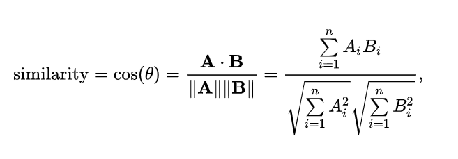

## 8.8 문서유사도 
### 문서 유사도 측정 방법 - 코사인 유사도 
- 코사인 유사도 : 벡터와 벡터 간 유사도 비교할 때, 벡터 크기보다 두 벡터 사이의 사잇각을 구해 벡터의 상호 방향성 기반 유사도 측정
- 유사할수록 두 벡터 사잇각이 작음 
- 장점 : 벡터의 크기가 아닌 방향성으로 측정하기 때문에 보다 유사한 문서 추출이 가능. 
    - 문서를 피처 벡터화하면 희소 행렬이 되는데, 유클리드 거리 기반 처럼 벡터 크기에 기반한 유사도 지표는 정확도가 떨어짐. 
    - 문서가 긴 경우 단어 빈도수가 많아져, 문서의 크기에 따라 빈도수가 달라지기 때문에 빈도수 기반으로는 문서 간 유사도 구하는 것이 의미 없음.
        - 예) 100문장의 A 문서에서 5번 머신러닝이 나오고, 10문장의 B 문서에서 4번 머신러닝이 나왔을 때 유사한가? 
    
#### 계산 식
- 두 벡터의 내적 값 = 두 벡터 크기 곱한 값 * 코사인 각도 값 
$$A*B=\parallel A \parallel\parallel B \parallel cos\theta$$
- 유사도 $cos\theta$ : 두 벡터 내적을 총 벡터 크기의 합으로 나눈 것. 
    = 내적 결과를 총 벡터 크기로 정규화한 것 

### 실습
- 사이킷런 코사인 유사도 측정 함수 제공 : sklearn.metrics.pariwise.cosine_similarity
    - 희소 행렬, 밀집 행렬 모두 가능
    - 별도의 변환 작업 필요 없음. 
1. TF-IDF 로 피처 벡터화 
2. 밀집 행렬로 변환
3. 코사인 유사도 측정
