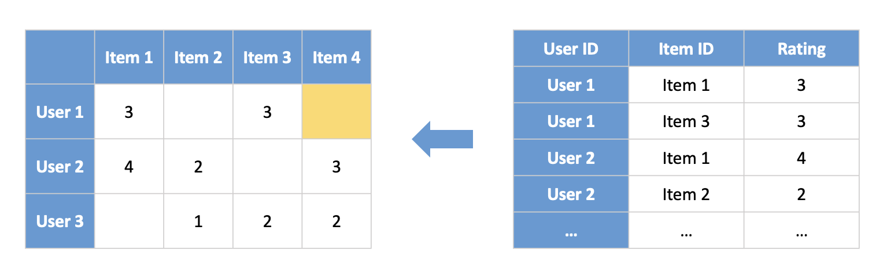
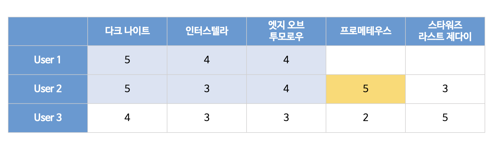
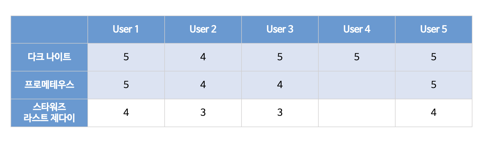
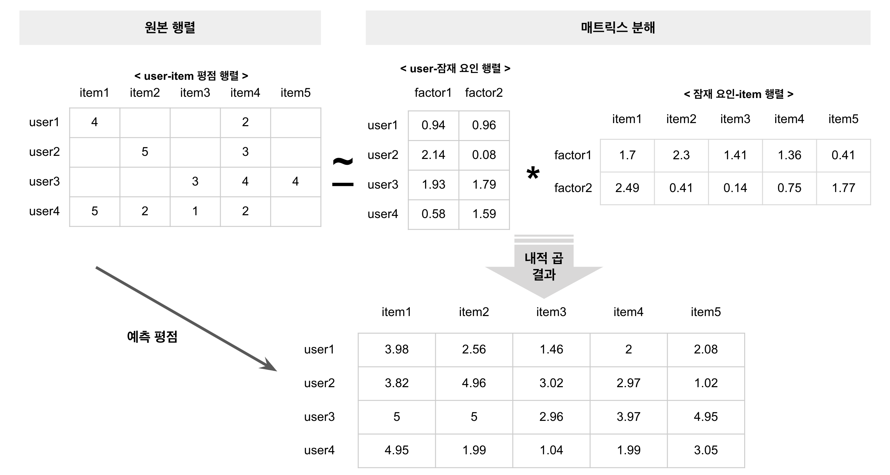

# 1. 추천시스템의 개요와 배경 
## 추천시스템 개요 
- 아마존 등 전자상거래 업체, 유튜브, 넷플릭스 등 콘텐츠 플랫폼 등 추천시스템을 활용하여 고객을 더 오래 머물게 하고, 더 많은 매출을 올림. 
- 얼마나 연관있는 콘텐츠를 추천하는지가 플랫폼의 신뢰를 결정함. 
- 더 똑똑한 추천 시스템을 갖추기 위해 고도화에 투자 
- 추천엔진은 사용자가 무엇을 원하는지 빠르게 찾아내어 한정된 시간 속에서 사용자의 선택 부담을 해결해주기 때문에 온라인 스토어에서 필수적으로 활용됨 
- 온라인 스토어에서는 사용자의 구매 이력, 장바구니 내역, 평점과 리뷰, 취향, 클릭 로그를 기반으로 개인화된 추천을 진행 

## 추천시스템의 유형 
- 콘텐츠 기반 필터링
- 협업 필터링 
    - 최근접 이웃 협업 필터링
    - 잠재 요인 협업 필터링 
- 넷플릭스 추천 시스템 경연 대회에서 행렬 분해 기법을 이용한 잠재 요인 협업 필터링이 우승하며 해당 시스템을 대부분의 온라인 스토어에서 적용 중 
- 서비스하는 아이템 특성에 따라 추천 엔진을 다르게 하거나 결합해서 사용

# 2. 콘텐츠 기반 필터링 
- 사용자가 특정한 아이템을 선호하는 경우, 그 아이템과 비슷한 콘텐츠를 가진 다른 아이템을 추천하는 방식 
- 특정 영화에 높은 평점을 줬으면, 그 영화의 장르, 출연 배우, 감독, 영화 키워드 등의 콘텐츠와 유사한 다른 영화를 추천해주는 방식 
- 콘텐츠 기반으로 사용자의 선호 프로파일을 구성

# 3. 최근접 이웃 협업 필터링 
- 나와 취향이 비슷한 친구가 추천해주는 방법 
- 사용자가 아이템에 매긴 평점 정보나 상품 구매 이력과 같은 사용자가 매긴 평점 정보나 상품 구매 이력과 같은 사용자 행동 양식 기반으로 추천 수행 
- 사용자-아이템 평점 매트릭스와 같은 축적된 사용자 행동 데이터 기반으로 사용자가 아직 평가하지 않은 아이템을 예측 평가
 
- 사용자-아이템 평점 매트릭스 
    - 행=개별 사용자, 열=개별 아이템, 값=평점
    - 모든 사용자가 모든 아이템에 대한 평점을 매기지 않으므로 희소 행렬 
- 최근접 이웃 협업 필터링 (=메모리 협업 필터링)
    - 사용자 기반(user-user): 당신과 비슷한 고객들이 다음 상품도 구매했습니다. 
    - 아이템 기반(item-item): 이 상품을 선택한 다른 고객들은 다음 상품도 구매했습니다. 
- 사용자 기반 최근접 이웃 방식
    - 특정 사용자와의 유사도를 측정해 가장 유사도가 높은 TOP-N 사용자 추출
    - TOP-N 사용자가 좋아하는 아이템 추천 

        - User 1 기준 User 3보다 User2 가 유사도가 높은 사용자
        - User2가 재밌게 본 프로메테우스를 User1에게 추천
- 아이템 기반 최근접 이웃 방식
    - 아이템 자체의 유사도 x, 해당 아이템에 대한 사용자의 선호도가 비슷한 아이템 추천
    - 아이템-사용자 평점 매트릭스 : 행=아이템, 열=개별사용자

        - 평점 분포 기준 다크나이트는 스타워즈보다 프로메테우스가 더 유사 
        - User 4에게 프로메테우스 추천 
- 일반적으로 사용자 기반보다 아이템 기반 협업 필터링이 정확도가 높음.
    - 비슷한 상품을 구매한게 취향이 비슷하다고 판단하다고 보기 어려움
    - 매우 유명한 영화는 취향에 관계없이 관람
    - 평점 매긴 영화가 많지 않아 유사도 측정하여 비교 어려움 
- 유사도 측정 방법 : 사용 데이터가 희소행렬이므로 코사인 유사도 사용  

# 4. 잠재 요인 협업 필터링 
- 사용자-아이템 평점 매트릭스 속 숨어 있는 잠재 요인 추출 
- 행렬 분해 : 대규모 다차원 행렬을 분해하는 과정에서 잠재 요인 추출
    - 다차원 희소행렬인 사용자-아이템 행렬 데이터 -> 저차원 밀집 행렬의 사용자-잠재요인행렬 / 아이템-잠재 요인 행렬의 전치행렬(잠재요인-아이템 행렬)로 분해 
    - 분해된 두 행렬 내적하여 새로운 예측 사용자-아이템 평점 행렬 데이터 생성 
    - 사용자가 평점 부여하지 않은 아이템에 대한 평점 예측 
    
- 잠재요인을 정확히 정의할 수 없지만 어떤 아이템이냐 따라 추정할 수는 있음
    - 예) 영화 평점 기반 사용자-아이템 평점 행렬  
        1) user-잠재 요인 행렬 >> 잠재요인 = 사용자-장르 선호도
        2) 잠재 요인-item 행렬 >> 잠재요인 = 영화-장르별 특성값
### 행렬 분해의 이해 
- 다차원 매트릭스를 저차원 매트릭스로 분해하는 기법
- SVD(Sigular Vector Decomposition), NMF(Non-Negative Matrix Factorization)등이 있음 
- M개의 사용자 행과 N개의 아이템 열을 가진 평점 행렬 R (M*N)
- 행렬 분해로 사용자-k차원 잠재 요인 행렬 P(M*K)와 K차원 잠재요인-아이템 행렬 Q.T(K\*N)로 분해 
- 분해 시 SVD 방식을 이용하는데, NaN 값이 없는 행렬만 적용할 수 있어 확률적 경사하강법을 이용해 SVD 수행
- 실제 값과 최소의 오류를 가질 수 있도록 행렬 분해 
- P와 Q행렬로 계산된 예측R과 실제 R 행렬 오류 최소화할 수 ㅇㅆ도록 반복적인 비용함수 최적화로 P와 Q 유추  
    - user-잠재 요인 행렬과 잠재 요인-item 행렬을 임의의 값으로 설정
    - 내적 곱을 통해 예측 행렬을 계산하고 예측 행렬과 실제 행렬의 오류값을 계산
    - 오류 값을 최소화 할 수 있게 잠재요인 행렬 업데이트
    - 만족할 만한 오류 값을 가질 때 까지 2~3번을 반복하면서 근사화